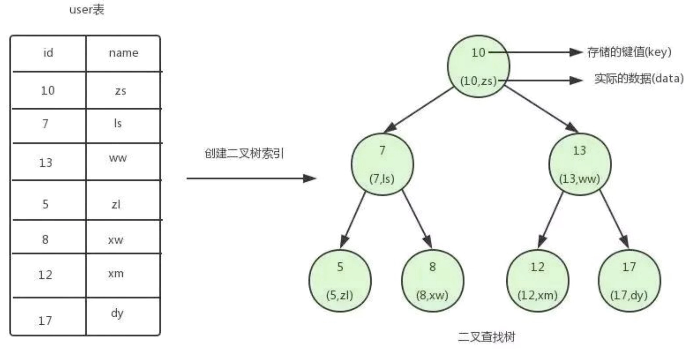
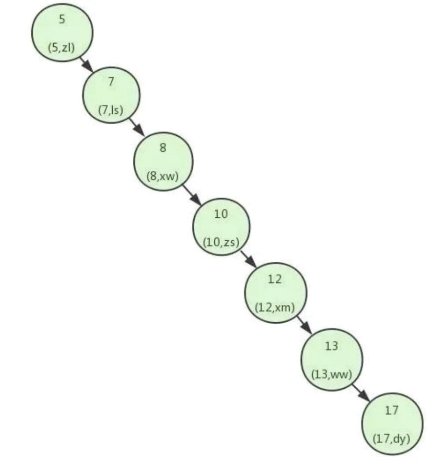
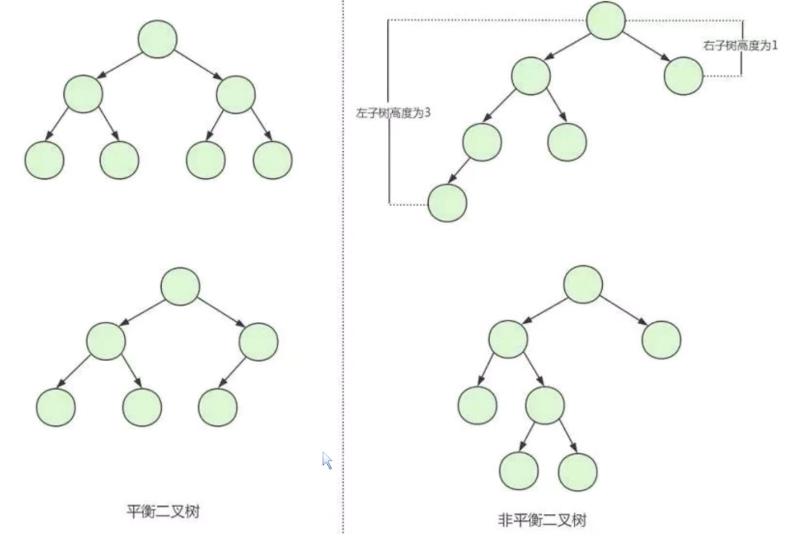
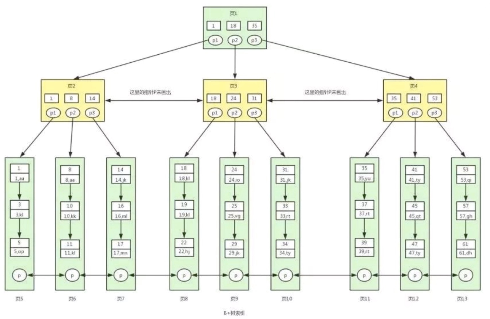

此为笔记，摘自Vin(维恩)的《大厂面试题》。非盈利摘抄，如确实冒犯到，请联系博主删除。

# 程序员面试这样解题数据库索引
以下面试题均基于mysql

## 能说说什么是索引吗？索引的种类有哪些？
索引(Index)是帮助数据库高效获取数据的数据结构。索引是基于数据库库表创建的，它包含表中某些列的值以及记录对应的地址，并且把这些值记录在一个数据结构中。最常见的就是使用**哈希表**、**B+树**作为索引，项目中我们使用的是InnoDB引擎，默认使用的是B+树。

::: tip
这个题的回答方式关键点在于哈希表和B+树如何作为索引的知识你一定要了解，面试官99%会问这两个的实现和差异。
:::

## 什么情况下适合建索引？
一般来说，在where和join语句出现的时候需要建索引，因为mysql对<, <=, =, >, >=, betweeen, in, 以及某些时候的like才会使用索引(以通配符%和_开头作查询时，mysql不会使用索引)。通常会根据慢查询日志来优化SQL以及判断是否建索引。

::: tip
这个题的回答我认为还需要加上数据量的考虑，工作中如果只是一些配置，数据量可控，比如内管配置只有几百条，其实没必要做索引，当然也可以做，但是最关键的是数据量大的表一定要考虑建索引或者分库分表或者缓存才能真的解决查询慢的问题。
:::

## 你们在创建索引的时候，都会考虑哪些因素？
在日常工作中，我们会通过开启慢查询去记录一些执行时间比较久的SQL语句，我们公司慢查询阈值是500ms，找出这些sql后，我们用explain命令来查看这些sql语句的执行计划，查看该sql有没有使用上索引，有没有全表扫描。把查询条件中没有建立索引的列创建索引。

::: tip
这个题的回答我觉得有点事后诸葛的味道，现实我在工作中考虑是否建立索引，一般都是基于业务场景下对未来数的预估的，数据量大的必须执行建索引、分库分表、缓存三板斧了。通过慢查询来反推动建立索引，是一种运维推动开发的方式，滞后了。《毛选》告诉我们，机动性是一个组织立于不败之地的不二法宝。我们作为开发，不能等运维告警，直接对新增的sql进行explain执行计划的分析，并在测试环境开启慢查询。也是开发的压测期间就要做，不能被其他组织牵着走。
:::

## 你们有用到联合索引吗？
有的，我们有对一些表中创建过联合索引。

## 在创建联合索引的时，你是怎么考虑多个字段之间的顺序的？
在创建联合索引时，我们根据业务需求， where子句中使用最频繁的一列放在最左边，因为mysql索引查询会遵循最左前缀匹配原则，即最左优先，在检索数据时从联合索引的最左边开始匹配。所以当我们创建一个联合索引的时候，如(key1, key2, key3), 相当于创建了(key1)、(key1, key2)和(key1, key2, key3)三个索引，这就是最左匹配原则。

::: tip
这个题的回答，我觉得不单只要考虑字段的使用频繁度，还要考虑两个点：
1. 离散性，越离散的越要放在左边，越趋同的越放在右边
2. 存在性，有些字段在现实中不一定存在，不一定存在的，放在最右边
:::

## 刚才你提到Mysql中具体采用B+树数据结构来实现索引，为什么会使用B+树？
由于索引是存在于磁盘中的，当索引非常大的时候，比如达到几个G的时候，无法一次性加载到内存中，所以数据库中索引使用的是查询效率更高的树形结构。B+树是平衡多路查找树，是为磁盘等外存储设计的一种平衡查找树。

系统从磁盘读取数据到内存时是以磁盘块(block)为基本单位的，位于同一个磁盘块中的数据会被一次性读取出来，InnoDB存储引擎中默认每个页的大小为16KB，可通过参数innodb_page_size设置页的大小。InnoDB在把磁盘数据读入到磁盘时会以页为单位，在查询数据时如果一个页中的每条数据都能有助于定位数据记录的位置，这将会减少磁盘I/O次数，提高查询效率。

B+树使用有序数组链表+平衡多叉树改良了B树的有序数组+平衡多叉树。B+树的关键字全部存放在叶子节点中，非叶子节点用来索引。而叶子节点中有一个指针指向下一个叶子节点，做这个优化的目的是为了提高区间访问的性能。

数据库采用B+树的主要原因是B+树提高了磁盘IO性能的同时并没有解决元素遍历效率低下的问题。正是为了解决这个问题，B+树应运而生。B+树只要遍历叶子节点就可以实现整棵树的遍历。而且在数据库中基于范围的查询是非常频繁的，也是B+树的优势所在。

例如：要查5\~10这个区间的，B+树一把到5这个标记，再一把到10，然后串起来就行了。而B树在找到第一个符合条件的数字5后，访问完第一个关键字所在的块后，得遍历这个树，获取下一个块，直到遇到一个不符合条件的关键字，遍历的过程比较复杂。

::: tip 索引结构的演变进而加强对B+树的理解
如果是二叉树作为索引，如下图：


但是如果是这种结构的二叉树呢？


那么会很尴尬，所以需要平衡二叉树(AVL)


根据平衡二叉树的特点呢，我们直到它虽然平衡了，但是数据量大的时候，它的高度会非常高，查找一个数需要很多次IO判断。
那么我们就需要一种能降低高度的数，那就是B数，如下图：


B树的特点是高度降低了，但是值是分散在各个节点的，根据上述磁盘读取块的知识，我们知道这样的结构，会导致索引文件会很大，查找范围会很困难。
所以就需要B+树，如下图：


B+树是B树的优化，主要是两点：
1. 节点不存储值，只存储在叶子节点
2. 叶子节点之间有索引连接
这样的升级优化，使得索引文件大小骤降，并且很适合范围查找。
:::

## B+树和Hash索引比较起来有什么优缺点吗?
哈希索引适合等值查询，但是无法进行范围查询；哈希索引没有办法利用索引完成排序；哈希索引不支持多列联合索引的最左匹配规则；如果有大量重复键值的情况下，哈希索引的效率会很低，可能存在哈希碰撞的问题。

::: tip
这个题的回答你就得提前掌握哈希碰撞怎么解决了，阿西吧，我是不知道数据库怎么解决的，但是可以参考一下jdk的HashMap吧~
:::

## 那你知道B+树的叶子节点都可以存储哪些东西吗？
InnoDB的B+树可能存储的是整行数据，也可能是主键的值。索引B+树的叶子节点存储了整行数据的是主键索引，也被称之为聚簇索引。而存储了主键的值的是非主键索引，也被称之为非聚簇索引。

## 聚簇索引和非聚簇索引，在查询数据的时候，有什么区别吗？
主键索引查询只会查一次，而非主键索引需要回表多次。通过覆盖索引也可以只查询一次，覆盖索引指一个查询语句的执行只用从索引中就能够取得，不必从数据库表中读取。
MySql只需要通过索引就可以返回所需要的数据，这样避免了查到索引后再返回表操作，减少I/O读取进而提高效率。

::: tip 聚簇索引和非聚簇索引
* 聚簇索引：以InnoDB作为存储引擎的表，表中的数据都会有一个主键，即使你不创建主键，系统也会帮你创建一个隐式的主键。
* 非聚簇索引：以主键以外的列值作为键值构建的B+树索引，我们称之为非聚簇索引。
以上是视频的理解，我觉得有点片面了，是以结果来作为原因了。

我的理解是区分是否是聚簇索引，关键看这个簇是否聚，也就是索引最后指向的目标数据，是否在索引的叶子节点上！如下：
* **聚簇索引**：索引的叶子节点存储数据
* **非聚簇索引**：索引的叶子节点不存储数据，而是存储数据的主键，需要回表查询
:::

## 如果每天几百万的数据，一个月就是几千万了，有没有对于查询做一些优化呢？
面试官预期：
1. 对分库分表、高并发系统的设计的理解，是否有真实高并发项目的开发经验
2. 了解面试者对中间件的理解，市场主流中间件的优缺点，以及如何选择

其实面试官问的是：
1. 为什么要分库分表(设计高并发系统的时候，数据库层面该如何设计)？
2. 用过哪些分库分表中间件？不同的分库分表中间件都有什么优点和缺点？
3. 你们具体是如何对数据库进行垂直拆分或者水平拆分的？

**答**：
Sharing-jdbc这种Client层方案的优点在于不用部署，运维成本低，不需要代理的二次转发请求，性能很高，但是如果遇到升级啥的需要各个系统都重新升级版本再发布，各个系统都需要耦合Sharing-jdbc的依赖；

Mycat这种proxy层方案的缺点在于需要部署，自己运维一套中间件，运维成本高，但是好处是在于对于各个项目是透明的，如果遇到升级之类的都是自己中间件那里搞就行了。

## 查询分页查询到limit 10000000, 10的时候，是如何优化的？
一个办法是通过**主键索引优化**,把上一次查询结果的最后一个的主键id带回来放入sql中。例如，原来的sql如下：
``` sql
SELECT * FROM cps_user_order_detail d WHERE d.order_time>'2020-8-5 00:00:00' ORDER BY d.order_time LIMIT 6;
```
增加maxId后，如下：
``` sql
SELECT * FROM cps_user_order_detail d WHERE d.id > #{maxId} AND d.order_time>'2020-8-5 00:00:00' ORDER BY d.order_time LIMIT 6;
```
但是这种方案有两个局限性：
1. 主键必须自增不能是UUID并且前端除了传基本分页参数pageNo,pageSize外，还必须把每次上一页的最大Id带过来
2. 该方式不支持随机跳页，也就是说只能上下翻页

二是通过**Elastic Search搜索引擎优化（基于倒排索引）**，实际上类似于淘宝这样的电商基本上都是把所有商品放进ES搜索引擎里的（那么海量的数据，放进MySQL是不可能的，放进Redis也不现实）。但即使用了ES搜索引擎，也还是有可能发生深度分页的问题的，这时怎么办呢？答案是通过游标scroll。

::: tip 
分析过程，可以参考少侠露飞的[MySQL深度分页的问题及优化方案：千万级数据量如何快速分页](https://blog.csdn.net/Carson_Chu/article/details/108445426)
:::

1. [MySQL深度分页的问题及优化方案：千万级数据量如何快速分页](https://blog.csdn.net/Carson_Chu/article/details/108445426)
2. [大数据学习[16]--使用scroll实现Elasticsearch数据遍历和深度分页[转]](https://www.cnblogs.com/jpfss/p/10826853.html)


