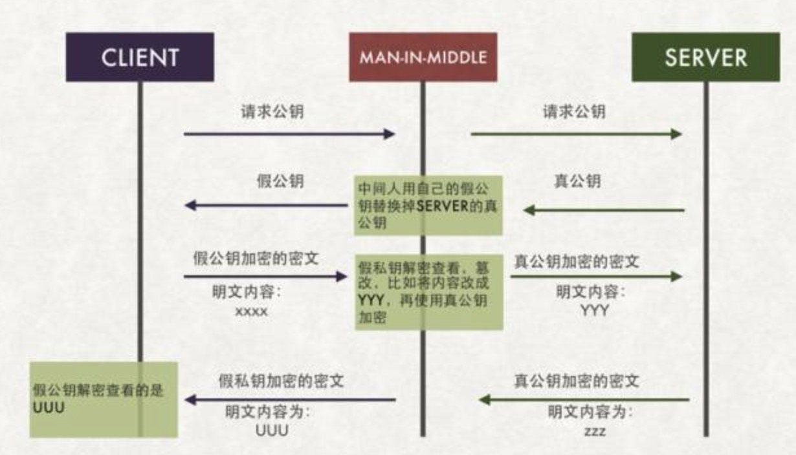
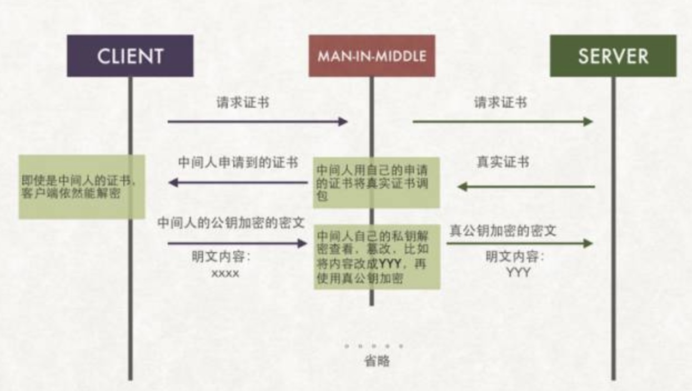
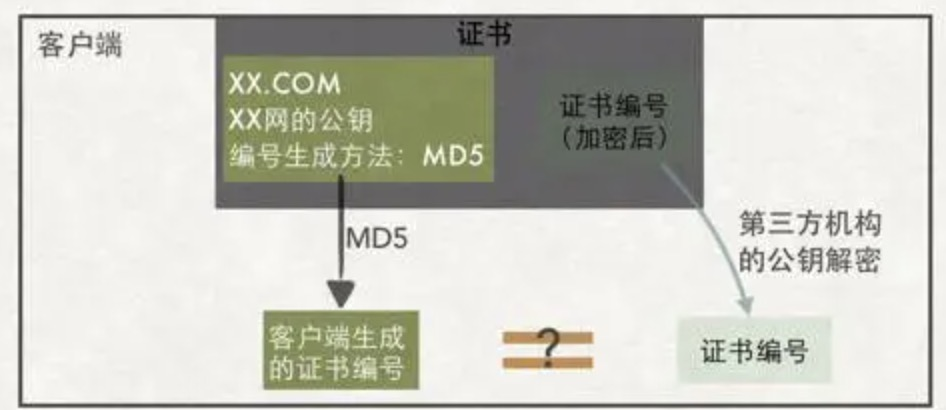
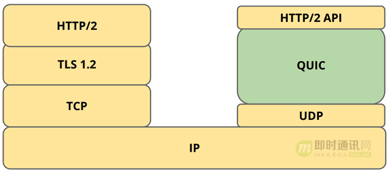
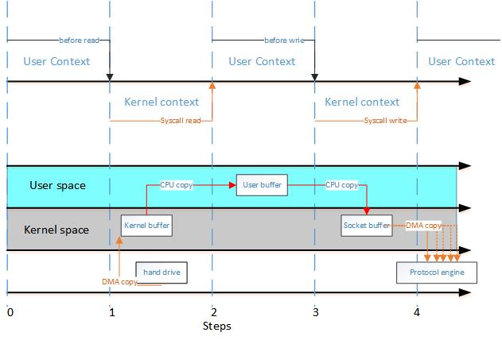
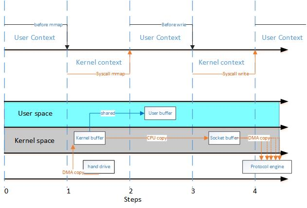
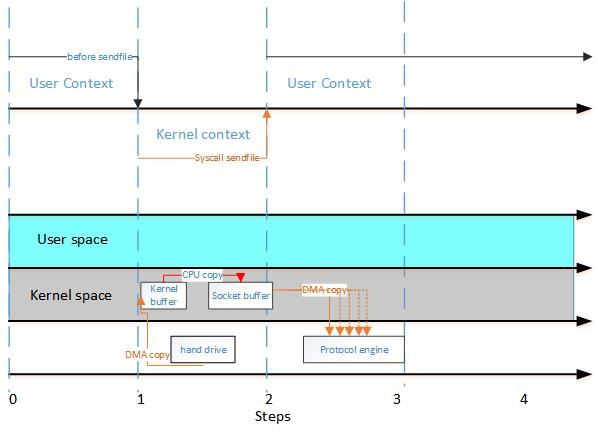
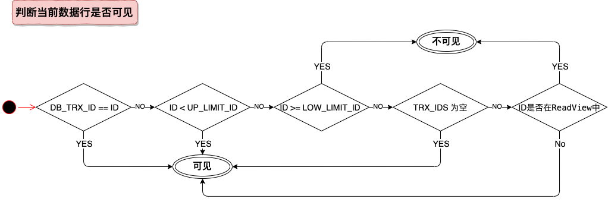

一二面过了并且明确有3面，本来只是去试试水，完全不抱希望的面试，突然给好像看到了光。

为了能抓到这一隙光，我准备利用周末这两天好好准备一下。

# 前期分析
以下是我前两面的面试内容：
1. mysql(事务级别、redo log、undo log、bin log、锁)、redis(为何单线程还高效、持久化原理)、juc(hashmap/concurrenthashmap)、io(select、epoll、iocp)，算法题是容器盛水
2. 项目方案(高并发方案、防黄牛方案、分布式容灾存储方案)、spring cloud config实现原理(我不知道，然后问如果自己实现一个怎么搞，我说了个方案)，算法题是多线程完成任务后再单线程处理后续
综上，我基本上算是面了数据库、中间件、java源码、项目方案、分布式方案。

所以我的预测3面可能会面以下内容：
1. 网络通信协议
2. JVM
3. linux底层命令
4. Spring
5. MQ
6. redis 
7. 项目方案

# 准备

## 网络通信协议
TCP/IP、UDP、Http/https，互联网开发必问内容，我觉得面试官不会落下，很可能会以一个页面请求到返回经历了什么为提问开始。

### 一个页面请求经历了什么协议
1. DNS域名解析器
2. TCP的3次握手
3. 建立TCP连接后发起http请求
4. 服务器端响应http请求，浏览器得到html代码
5. 浏览器解析html代码，并请求html代码中的资源
6. 浏览器对页面进行渲染呈现给用户
7. 后续TCP4次挥手断开连接

### 什么是HTTP的长连接
HTTP协议是无状态的，HTTP的长连接本质上是TCP长连接。

在HTTP/1.0中，默认使用的是短连接。也就是说，浏览器和服务器每进行一次HTTP操作，就建立一次连接，但任务结束就中断连接。如果客户端浏览器访问的某个HTML或其他类型的Web页中包含有其他的Web资源，如JavaScript文件、图像文件、CSS文件等；当浏览器每遇到这样一个Web资源，就会建立一个HTTP会话。

但从 HTTP/1.1起，默认使用长连接，用以保持连接特性。使用长连接的HTTP协议，会在响应头有加入这行代码：

        Connection:keep-alive

在使用长连接的情况下，当一个网页打开完成后，客户端和服务器之间用于传输HTTP数据的 TCP连接不会关闭，如果客户端再次访问这个服务器上的网页，会继续使用这一条已经建立的连接。Keep-Alive不会永久保持连接，它有一个保持时间，可以在不同的服务器软件（如Apache）中设定这个时间。实现长连接要客户端和服务端都支持长连接。

在nginx.conf配置指定http版本和keepalive时长：
``` bash
keepalive 500; ## 默认为0. 设置每个worker可以保持长连接空闲时的最大连接数
keepalive_timeout  120s; ##开启keepalive，超时时间为120秒，如果客户端120秒内没有后续的请求过来，nginx就会断掉这个TCP连接，设置为0表示禁用keepalive
keepalive_requests 1000; ##用于设置一个keep-alive连接上可以服务的请求的最大数量，当最大请求数量达到时，连接被关闭。默认是100。这个参数的真实含义，是指一个keep alive建立之后，nginx就会为这个连接设置一个计数器，记录这个keep alive的长连接上已经接收并处理的客户端请求的数量。如果达到这个参数设置的最大值时，则nginx会强行关闭这个长连接，逼迫客户端不得不重新建立新的长连接。因此对于QPS较高的场景，非常有必要加大这个参数，以避免出现大量连接被生成再抛弃的情况，减少TIME_WAIT。
proxy_http_version 1.1; 
proxy_set_header Connection ""; ## 1.1 的 Connection 头需要清空
```

不过是否设置长连接也要考虑业务场景，数据库的连接用长连接，如果用短连接频繁的通信会造成socket错误，而且频繁的socket 创建也是对资源的浪费。

而像WEB网站的http服务一般都用短链接，因为长连接对于服务端来说会耗费一定的资源，而像WEB网站这么频繁的成千上万甚至上亿客户端的连接用短连接会更省一些资源，如果用长连接，而且同时有成千上万的用户，如果每个用户都占用一个连接的话，那可想而知吧。所以并发量大，但每个用户无需频繁操作情况下需用短连好。

### 如果用的是https，请求是怎样建立的
首先通过这几步理解一下为何要有https
1. 我们首先要理解https是为了安全而生的，这里的安全指的是数据传输过程中不被篡改、读取的安全。
2. 为了传输过程中的数据安全，那就必须对传输的数据进行加密。而为了加密的高效率，要使用对称加密。
3. 那么服务端和客户端必须先约定好用哪种对称加密算法，我们仅考虑互联网端的场景，成千上万的用户，要用成千上万不同的加密算法，这当然不可能，所以，协商的应该是对称加密算法的加密因子。
4. 协商加密因子的过程是不是也是明文的，一样会被窃取到，所以我们需要证书和非对称加密来完成对称算法的加密因子的协商过程。

理解了为什么要做，以及关键目标是什么，我们再看看https是如何做的。
1. 首先，客户端请求服务端的时候，要带上自己支持什么对称加密算法
2. 服务器端选择好对称加密算法后，把证书发回去，证书里包含服务端的非对称加密的公钥和一些相关信息
3. 客户端拿到证书后，先去校验一下证书是不是合法的，检测无误后，产生一个随机加密因子X，把X用服务器端的公钥加密，然后发回去给服务器端
4. 服务器端拿到自己公钥加密后加密因子后，用自己的私钥解密，然后，再用这个加密因子做对称加密，把X再发回去给客户端
5. 客户端拿到对称加密加密好的X后，用同样的加密因子解密，拿出来看是X，恩，安全的通道建立完成，以后都用这个方式双方加密通信

#### ①以上的步骤，能防止**中间人**攻击吗？
中间人攻击就是指有个客户端和服务端通信的时候，中间有个机器拦截了客户端的所有请求，然后假装自己是客户端给服务器端发送请求，待服务器端响应后，中间机器再把响应拦截后，自己组装一个新的响应假装自己是服务器，再发回去给客户端的一个模型。



上面建立连接的过程中，中间人确实可以拿到客户端的请求，也能拿到服务器端返回的证书和公钥。但是，第3步，客户端用服务器端的公钥加密后，中间人是无法解密里面的内容的，因为这里采用的是非对称的加密算法，私钥才能解开，而私钥只有服务器端有。并且，证书是第三方机构认证的，浏览器可以判定证书是被篡改。所以，这一步开始，中间人就没辙了，他只能选择完整地把请求的包发给服务器端。由于无法获取到对称加密的因子，中间人后续拦截的请求和响应，都无法解密，所以中间人攻击失效了。

#### ②那如果我证书都造假呢？
第三方机构不可能只给你一家公司制作证书，它也可能会给中间人这样有坏心思的公司发放证书。


客户端能解密同一家第三机构颁发的所有证书：


最终导致其它持有同一家第三方机构证书的中间人可以进行调包：


#### ③数字签名，解决同一机构颁发的不同证书被篡改问题
客户端是辨别同一机构下不同证书的地方，客户端在拿到证书后，自己要有能力分辨证书是否被篡改了。

证书上写着如何根据证书的内容生成证书编号。客户端拿到证书后根据证书上的方法自己生成一个证书编号，如果生成的证书编号与证书上的证书编号相同，那么说明这个证书是真实的。


同时，为避免证书编号本身又被调包，所以使用第三方的私钥进行加密。
证书的制作如图所示。证书中的“编号生成方法MD5”就是告诉客户端：你使用MD5对证书的内容求值就可以得到一个证书编号。


但是第三方机构的公钥怎么跑到了客户端的机器中呢？世界上这么多机器。

其实呢，现实中，浏览器和操作系统都会维护一个权威的第三方机构列表（包括它们的公钥）。因为客户端接收到的证书中会写有颁发机构，客户端就根据这个颁发机构的值在本地找相应的公钥。

题外话：如果浏览器和操作系统这道防线被破了，就没办法。想想当年自己装过的非常规XP系统，都害怕。

说到这里，想必大家已经知道上文所说的，证书就是HTTPS中数字证书，证书编号就是数字签名，而第三方机构就是指数字证书签发机构（CA）。

#### ④CA如何颁发数字证书给服务器端的？
我们如何向CA申请呢？每个CA机构都大同小异，我在网上找了一个：


#### ⑤https总结
HTTPS交互图:


* **1）** 客户端请求建立SSL连接，并将自己支持的一套加密规则发送给网站。
* **2）** 网站从中选出一组加密算法与HASH算法，并将自己的身份信息以证书的形式发回给浏览器。证书里面包含了网站地址，加密公钥，以及证书的颁发机构等信息
* **3）** 获得网站证书之后浏览器要做以下工作：
``` bash 
Ø 验证证书的合法性（域名、生成签名对比）
Ø 如果证书受信任，浏览器会生成一串随机数的密码，并用证书中提供的服务器公钥加密。
Ø 使用约定好的HASH计算握手消息
Ø 使用生成的随机数对消息进行加密，最后将之前生成的所有信息发送给网站。
```
* **4）** 网站接收浏览器发来的数据之后要做以下的操作：
``` bash 
Ø 使用自己的私钥将信息解密取出密码
Ø 使用密码解密浏览器发来的握手消息，并验证HASH是否与浏览器发来的一致。
Ø 使用密码加密一段握手消息，发送给浏览器
```
* **5）** 浏览器解密并计算握手消息的HASH，如果与服务端发来的HASH一致，此时握手结束。
* **6）** 使用随机密码和对称加密算法对传输的数据加密，传输。

为了让客户端与服务器端安全地协商出一个对称加密算法。这就是HTTPS中的SSL/TLS协议主要干的活。剩下的就是通信时双方使用这个对称加密算法进行加密解密。

#### HTTP的缺点与HTTPS有哪些改进
http的传输是不安全的,https是http+ssl证书进行加密的,所以比http安全。

HTTP优化：
* 资源内敛 : 资源内联 : 既然每个资源的首次访问都会存在握手等rtt损耗,那么越少数量的资源请求就越好,例如咋一个html中src访问css,不如直接将其这个css集成到html中
* 图片懒加载 ; 用到的时候在加载,这个已经很普遍了,就不细说了
* 服务器渲染 : 让服务端先将页面渲染好,在发送给客户端,也可以减少rtt的次数

HTTPS优化：
1. **CDN接入** :HTTPS 增加的延时主要是传输延时 RTT，RTT 的特点是节点越近延时越小，CDN 天然离用户最近，因此选择使用 CDN 作为 HTTPS 接入的入口，将能够极大减少接入延时。CDN 节点通过和业务服务器维持长连接、会话复用和链路质量优化等可控方法，极大减少 HTTPS 带来的延时。
2. **会话缓存** :虽然前文提到 HTTPS 即使采用会话缓存也要至少1\*RTT的延时，但是至少延时已经减少为原来的一半，明显的延时优化;同时，基于会话缓存建立的 HTTPS 连接不需要服务器使用RSA私钥解密获取 Pre-master 信息，可以省去CPU 的消耗。如果业务访问连接集中，缓存命中率高，则HTTPS的接入能力讲明显提升。当前TRP平台的缓存命中率高峰时期大于30%，10k/s的接入资源实际可以承载13k/的接入，收效非常可观。

3. **硬件加速** :为接入服务器安装专用的SSL硬件加速卡，作用类似 GPU，释放 CPU，能够具有更高的 HTTPS 接入能力且不影响业务程序的。测试某硬件加速卡单卡可以提供35k的解密能力，相当于175核 CPU，至少相当于7台24核的服务器，考虑到接入服务器其它程序的开销，一张硬件卡可以实现接近10台服务器的接入能力。

4. **远程解密** :本地接入消耗过多的 CPU 资源，浪费了网卡和硬盘等资源，考虑将最消耗 CPU 资源的RSA解密计算任务转移到其它服务器，如此则可以充分发挥服务器的接入能力，充分利用带宽与网卡资源。远程解密服务器可以选择 CPU 负载较低的机器充当，实现机器资源复用，也可以是专门优化的高计算性能的服务器。当前也是 CDN 用于大规模HTTPS接入的解决方案之一。

5. **SPDY/HTTP2** :前面的方法分别从减少传输延时和单机负载的方法提高HTTPS 接入性能，但是方法都基于不改变HTTP 协议的基础上提出的优化方法，SPDY/HTTP2 利用TLS/SSL 带来的优势，通过修改协议的方法来提升HTTPS 的性能，提高下载速度等。

**队头阻塞**：
http1.1协议通过长连接方式让多个同域名下的请求复用同一连接，但是必须排队使用。B请求需要等到A请求完成后进行，这样就可能导致队头阻塞现象(Head-of-line blocking)，A请求不完成，后面的请求BCD都会被delay住而无法发起。

谷歌提出的SPDY协议的多路复用机制一定程度上缓解了队头阻塞现象，SPDY规定，同一链路上的请求不再依次等待，大家可以间隔进行，于是可能存在一条链路上依次有A->C->B->A的序列，你看B请求不用再等待A，C请求也不用等待B。


### TCP的三次握手和四次挥手

首先我们看一下TCP的头部图，以便更好地理解三次握手和四次挥手中的一些参数的意思。
``` 
    0                   1                   2                   3   
    0 1 2 3 4 5 6 7 8 9 0 1 2 3 4 5 6 7 8 9 0 1 2 3 4 5 6 7 8 9 0 1 
   +-+-+-+-+-+-+-+-+-+-+-+-+-+-+-+-+-+-+-+-+-+-+-+-+-+-+-+-+-+-+-+-+
   |          Source Port          |       Destination Port        |
   +-+-+-+-+-+-+-+-+-+-+-+-+-+-+-+-+-+-+-+-+-+-+-+-+-+-+-+-+-+-+-+-+
   |                        Sequence Number                        |
   +-+-+-+-+-+-+-+-+-+-+-+-+-+-+-+-+-+-+-+-+-+-+-+-+-+-+-+-+-+-+-+-+
   |                    Acknowledgment Number                      |
   +-+-+-+-+-+-+-+-+-+-+-+-+-+-+-+-+-+-+-+-+-+-+-+-+-+-+-+-+-+-+-+-+
   |  Data |           |U|A|P|R|S|F|                               |
   | Offset| Reserved  |R|C|S|S|Y|I|            Window             |
   |       |           |G|K|H|T|N|N|                               |
   +-+-+-+-+-+-+-+-+-+-+-+-+-+-+-+-+-+-+-+-+-+-+-+-+-+-+-+-+-+-+-+-+
   |           Checksum            |         Urgent Pointer        |
   +-+-+-+-+-+-+-+-+-+-+-+-+-+-+-+-+-+-+-+-+-+-+-+-+-+-+-+-+-+-+-+-+
   |                    Options                    |    Padding    |
   +-+-+-+-+-+-+-+-+-+-+-+-+-+-+-+-+-+-+-+-+-+-+-+-+-+-+-+-+-+-+-+-+
   |                             data                              |
   +-+-+-+-+-+-+-+-+-+-+-+-+-+-+-+-+-+-+-+-+-+-+-+-+-+-+-+-+-+-+-+-+
                         
```
3次握手图：


4次回收图：


TCP 使用超时重传来实现可靠传输：如果一个已经发送的报文段在超时时间内没有收到确认，那么就重传这个报文段。一个报文段从发送再到接收到确认所经过的时间称为往返时间 RTT。

#### 为什么连接的时候是三次握手，关闭的时候却是四次握手？
1. 因为当Server端收到Client端的SYN连接请求报文后，可以直接发送SYN+ACK报文。其中ACK报文是用来应答的，SYN报文是用来同步的。
2. 但是关闭连接时，当Server端收到FIN报文时，很可能并不会立即关闭SOCKET，所以只能先回复一个ACK报文，告诉Client端，"你发的FIN报文我收到了"。只有等到我Server端所有的报文都发送完了，我才能发送FIN报文，因此不能一起发送。

故需要四步握手。

#### 为什么不能用两次握手进行连接？
3次握手完成两个重要的功能，既要双方做好发送数据的准备工作(双方都知道彼此已准备好)，也要允许双方就初始序列号进行协商，这个序列号在握手过程中被发送和确认。

如果只有两次的话，最后服务器端无法确认客户端是否收到了它的SYN报文，连接不可靠。

#### 为什么TIME_WAIT状态需要经过2MSL(最大报文段生存时间)才能返回到CLOSE状态？
1. MSL的意思是最大报文生命周期，指的是服务器和客户端之间的一个片段在网络中最大的存活时间。
2. 最后一个ACK有可能丢失，Server如果没有收到ACK，将不断重复发送FIN片段，TIME_WAIT状态就是用来重发可能丢失的ACK报文。
3. 基于2，客户端发出ACK如果1个MSL没到服务器端，服务器端会重发FIN，而从服务器端到客户端的时间也是1个MSL，所以2MSL可以保证客户端没有收到服务器端的重发FIN报文，以此得出ACK是到达服务器端了的。
4. 防止“已失效的连接请求报文段”出现在本连接中。客户端发送完最后一个ACK报文段后，再经过2MSL，就可以使本连接持续的时间内所产生的所有报文段都从网络中消失，使下一个新的连接中不会出现这种旧的连接请求报文段。

#### 如果已经建立了连接，但是客户端突然出现故障了怎么办？
TCP还设有一个保活计时器，显然，客户端如果出现故障，服务器不能一直等下去，白白浪费资源。服务器每收到一次客户端的请求后都会重新复位这个计时器，时间通常是设置为2小时，若两小时还没有收到客户端的任何数据，服务器就会发送一个探测报文段，以后每隔75秒钟发送一次。若一连发送10个探测报文仍然没反应，服务器就认为客户端出了故障，接着就关闭连接。

#### 如果服务端主动关闭连接会怎么样？
如果服务端主动关闭连接，那么服务端就会先发送fin，最后要有个2MSL的TIME-WAIT。
如果服务端在一段时间内主动关闭的连接比较多，则服务端会有大量的TIME-WAIT状态的连接要等2MSL时间，rfc793规定的MSL通常为2分钟。

#### 解决服务器存在大量TIME_WAIT和CLOSE_WAIT状态
1. CLOSE_WAIT是服务器主动关闭连接出现的
2. TIME_WAIT是客户端主动关闭连接出现的
3. 可以适当调整/etc/sysctl.conf里net.ipv4.tcp_fin_timeout的值，执行 /sbin/sysctl -p 让参数生效

#### TCP和UDP的区别
1. TCP的报文头部复杂，字段多。UDP的报文头部简单，只有两个端口，数据包长度和校验值。
2. TCP是面向连接的，提供可靠交付。UDP是无连接的，尽最大可能交付。
3. TCP有流量控制，拥塞控制，提供全双工通信，面向字节流，每一条 TCP 连接只能是点对点的（一对一）。UDP没有拥塞控制，面向报文，支持一对一、一对多、多对一和多对多的交互通信。

#### TCP粘包拆包及解决办法
粘包就是服务器端接收到的数据包其实有1.x个客户端定义的报文包，拆包的意思是服务器端接收到的数据包其实有0.x个客户端定义的报文包。

**为什么会发生 TCP 粘包、拆包？**
1. 要发送的数据大于 TCP 发送缓冲区剩余空间大小，将会发生拆包。
2. 待发送数据大于 MSS（最大报文长度），TCP 在传输前将进行拆包。
3. 要发送的数据小于 TCP 发送缓冲区的大小，TCP 将多次写入缓冲区的数据一次发送出去，将会发生粘包。
4. 接收数据端的应用层没有及时读取接收缓冲区中的数据，将发生粘包。(PSH标志位就是让服务器端赶紧读缓冲区)

**粘包、拆包解决办法**
由于 TCP 本身是面向字节流的，无法理解上层的业务数据，所以在底层是无法保证数据包不被拆分和重组的，这个问题只能通过上层的应用协议栈设计来解决，根据业界的主流协议的解决方案，归纳如下：

* **消息定长** ：发送端将每个数据包封装为固定长度（不够的可以通过补 0 填充），这样接收端每次接收缓冲区中读取固定长度的数据就自然而然的把每个数据包拆分开来。
* **设置消息边界** ：也就是分隔符，服务端从网络流中按消息边界分离出消息内容。在包尾增加回车换行符进行分割，例如 FTP 协议。
* **将消息分为消息头和消息体** ：消息头中包含表示消息总长度（或者消息体长度）的字段。
* 更复杂的应用层协议比如**Netty** 中实现的一些协议都对粘包、拆包做了很好的处理。

#### TCP 滑动窗口
窗口是缓存的一部分，用来暂时存放字节流。发送方和接收方各有一个窗口，接收方通过 TCP 报文段中的窗口字段告诉发送方自己的窗口大小，发送方根据这个值和其它信息设置自己的窗口大小。

发送窗口内的字节都允许被发送，接收窗口内的字节都允许被接收。如果发送窗口左部的字节已经发送并且收到了确认，那么就将发送窗口向右滑动一定距离，直到左部第一个字节不是已发送并且已确认的状态；接收窗口的滑动类似，接收窗口左部字节已经发送确认并交付主机，就向右滑动接收窗口。

接收窗口只会对窗口内最后一个按序到达的字节进行确认，例如接收窗口已经收到的字节为 {31, 34, 35}，其中 {31} 按序到达，而 {34, 35} 就不是，因此只对字节 31 进行确认。发送方得到一个字节的确认之后，就知道这个字节之前的所有字节都已经被接收。


#### TCP 流量控制
流量控制是为了控制发送方发送速率，保证接收方来得及接收。

接收方发送的确认报文中的窗口字段可以用来控制发送方窗口大小，从而影响发送方的发送速率。将窗口字段设置为 0，则发送方不能发送数据。

**实际上，为了避免此问题的产生，发送端主机会时不时的发送一个叫做窗口探测的数据段**，此数据段仅包含一个字节来获取最新的窗口大小信息。

#### TCP 拥塞控制
如果网络出现拥塞，分组将会丢失，此时发送方会继续重传，从而导致网络拥塞程度更高。因此当出现拥塞时，应当控制发送方的速率。这一点和流量控制很像，但是出发点不同。流量控制是为了让接收方能来得及接收，而拥塞控制是为了降低整个网络的拥塞程度。

TCP 主要通过四个算法来进行拥塞控制：
1. 慢开始
2. 拥塞避免
3. 快重传
4. 快恢复

发送方需要维护一个叫做拥塞窗口（cwnd）的状态变量，注意拥塞窗口与发送方窗口的区别：拥塞窗口只是一个状态变量，实际决定发送方能发送多少数据的是发送方窗口。
为了便于讨论，做如下假设：
* 接收方有足够大的接收缓存，因此不会发生流量控制；
* 虽然 TCP 的窗口基于字节，但是这里设窗口的大小单位为报文段。


**慢开始与拥塞避免**

发送的最初执行慢开始，令 cwnd = 1，发送方只能发送 1 个报文段；当收到确认后，将 cwnd 加倍，因此之后发送方能够发送的报文段数量为：2、4、8 ...

注意到慢开始每个轮次都将 cwnd 加倍，这样会让 cwnd 增长速度非常快，从而使得发送方发送的速度增长速度过快，网络拥塞的可能性也就更高。设置一个慢开始门限 ssthresh，当 cwnd >= ssthresh 时，进入拥塞避免，每个轮次只将 cwnd 加 1。

如果出现了超时，则令 ssthresh = cwnd / 2，然后重新执行慢开始。

**快重传与快恢复**

在接收方，要求每次接收到报文段都应该对最后一个已收到的有序报文段进行确认。例如已经接收到 M1 和 M2，此时收到 M4，应当发送对 M2 的确认。

在发送方，如果收到三个重复确认，那么可以知道下一个报文段丢失，此时执行快重传，立即重传下一个报文段。例如收到三个 M2，则 M3 丢失，立即重传 M3。

在这种情况下，只是丢失个别报文段，而不是网络拥塞。因此执行快恢复，令 ssthresh = cwnd / 2 ，cwnd = ssthresh，注意到此时直接进入拥塞避免。

慢开始和快恢复的快慢指的是 cwnd 的设定值，而不是 cwnd 的增长速率。慢开始 cwnd 设定为 1，而快恢复 cwnd 设定为 ssthresh。


#### 一泡尿的时间，快速读懂QUIC协议
QUIC 是 Quick UDP Internet Connections 的缩写，谷歌发明的新传输协议。

与 TCP 相比，QUIC 可以减少延迟。QUIC 协议可以在 1 到 2 个数据包（取决于连接的服务器是新的还是已知的）内，完成连接的创建（包括 TLS）。

从表面上看：QUIC 非常类似于在 UDP 上实现的 TCP + TLS + HTTP/2。由于 TCP 是在操作系统内核和中间件固件中实现的，因此对 TCP 进行重大更改几乎是不可能的（TCP 协议栈通常由操作系统实现，如 Linux、Windows 内核或者其他移动设备操作系统。修改 TCP 协议是一项浩大的工程，因为每种设备、系统的实现都需要更新）。但是，由于 QUIC 建立在 UDP 之上，因此没有这种限制。QUIC 可以实现可靠传输，而且相比于 TCP，它的流控功能在用户空间而不在内核空间，那么使用者就不受限于 CUBIC 或是 BBR，而是可以自由选择，甚至根据应用场景自由调整优化。

QUIC 与现有 TCP + TLS + HTTP/2 方案相比，有以下几点主要特征：
1. 利用缓存和DH密钥交换算法，显著减少连接建立时间；
2. 改善拥塞控制，拥塞控制从内核空间到用户空间，stream、packet自增序列防止重传误解、；
3. 没有连接复用的队头阻塞(head of line)的多路复用；
4. 前向纠错，减少重传；
5. 连接平滑迁移，网络状态的变更不会影响连接断线。


## java8新特性

## 如何优雅地关闭java进程
1. 添加shutdownHook，处理一些java进程关闭之前的操作，比如关闭文件
2. 添加SignalHandler，监听kill -15的关闭事件TERM
3. 在java的停止脚本中，执行kill -15

## JVM
垃圾回收算法CMS和G1的步骤和区别

可达性分析(为何不用计数法，以及三色理论，染色指针)

### 可达性分析
[可达性分析算法](https://blog.csdn.net/qq_44802992/article/details/109909988)

### 三色理论
[JVM之三色标记算法](https://blog.csdn.net/weixin_44096133/article/details/109263967)
[CMS与三色标记算法](https://javap.blog.csdn.net/article/details/109558171)

### ZGC的染色指针
之前的垃圾回收器用的都是对象头上的位置来存储三色标记，但是这样会造成内存浪费。

Linux下64位指针的高18位不能用来寻址，但剩余的46位指针所能支持的64TB内存在今天仍然能够充分满足大型服务器的需要。鉴于此，ZGC的染色指针技术继续盯上了这剩下的46位指针宽度，将其高4位提取出来存储四个标志信息。通过这些标志位，虚拟机可以直接从指针中看到其引用对象的三色标记状态、是否进入了重分配集（即被移动过）、是否只能通过finalize()方法才能被访问到。当然，由于这些标志位进一步压缩了原本就只有46位的地址空间，也直接导致 ZGC能够管理的内存不可以超过4TB（2的42次幂）

[colored-pointer.jpeg](./../../images/colored-pointer.jpeg)

染色指针的三大优势
1. 一旦某个Region的存活对象被移走之后，这个Region立即就能够被释放和重用掉，而不必等待整个堆中所有指向该Region的引用都被修正后才能清理
2. 染色指针可以大幅减少在垃圾收集过程中内存屏障的使用数量
3. 可以作为一种可扩展的存储结构用来记录更多与对象标记、重定位过程相关的数据，以 便日后进一步提高性能


### jvm内存模型
参考[Java内存模型](./../java/java-memory-model.html?_blank))

### 如何定位gc问题
1. 查看日志，确认gc问题的表象，是否影响到业务
2. 在目标机器上执行**java -XX:PrintCommandLineFlags -version**查看配置的JVM启动参数，主要关心堆空间新老层大小和比例的分配，老年代晋升的设置，以及确认是什么垃圾回收算法
3. 如果1的方法无法看到，那么说明用的是默认配置，也可以用**java -XX:PrintFlagsFinal -version**查看默认配置
4. 使用jstat命令查看当前gc情况，**jstat -gc {pid}**，主要关注MinorGC和FullGC的次数，耗时，各部位的大小
5. 使用jstat命令查看当前gc的可能原因，**jstat -gccause {pid}**，如果看不出什么来，可以在末尾加个时间持续打印观察，如：**jstat -gc {pid} 100**，100毫秒打印一次，如果gfullc频繁，应该可以看到GCC下打印的字段，要么的内存分配失败，要么是在调整，要么是System.gc。如果是System.gc，那么需要查看代码，看哪里调用了System.gc，搜索代码的时候，可以把三方包的代码也加上，防止是因为三方包的代码导致的。如果是分配内存失败导致的fullgc，那么需要重新观察堆各个部分的大小和增长速度。
6. 5中如果是内存分配失败，那么说明存在一直创建的对象，这个时候，需要用jmap打出多个时间段的dump文件，然后使用MAT工具对比查看哪部分的对象多。
7. 根据前5步，应该能基本定位到对应代码，这个时候专心看代码。
8. 有一定的想法后，在测试环境复现，并修复，方案ok后，同步到生产。

### happen-before原则
* 单线程happen-before原则：在同一个线程中，书写在前面的操作happen-before后面的操作。
* 锁的happen-before原则：同一个锁的unlock操作happen-before此锁的lock操作。
* volatile的happen-before原则：对一个volatile变量的写操作happen-before对此变量的任意操作(当然也包括写操作了)。
* happen-before的传递性原则：如果A操作 happen-before B操作，B操作happen-before C操作，那么A操作happen-before C操作。
* 线程启动的happen-before原则：同一个线程的start方法happen-before此线程的其它方法。
* 线程中断的happen-before原则：对线程interrupt方法的调用happen-before被中断线程的检测到中断发送的代码。
* 线程终结的happen-before原则：线程中的所有操作都happen-before线程的终止检测。
* 对象创建的happen-before原则：一个对象的初始化完成先于他的finalize方法调用。

## linux底层命令

### nohup /dev/null 2>&1 含义的使用
nohup是将程序以忽略挂起信号的方式运行起来，被运行的程序的输出信息将不会显示到终端。

对于 &1 更准确的说应该是文件描述符 1,而1 一般代表的就是STDOUT_FILENO,实际上这个操作就是一个dup2(2)调用.他标准输出到all_result ,然后复制标准输出到文件描述符2(STDERR_FILENO),其后果就是文件描述符1和2指向同一个文件表项,也可以说错误的输出被合并了.其中0 表示键盘输入 1表示屏幕输出 2表示错误输出.把标准出错重定向到标准输出,然后扔到/DEV/NULL下面去。通俗的说，就是把所有标准输出和标准出错都扔到垃圾桶里面。

为何2>&1要写在后面？

2>&1 标准错误拷贝了标准输出的行为，但此时标准输出还是在终端。>file 后输出才被重定向到file，但标准错误仍然保持在终端。

为什么要用 /dev/null 2>&1 这样的写法.这条命令的意思是将标准输出和错误输出全部重定向到/dev/null中,也就是将产生的所有信息丢弃.下面我就为大家来说一下, command > file 2>file   与command > file 2>&1 有什么不同的地方.
首先\~command > file 2>file 的意思是将命令所产生的标准输出信息,和错误的输出信息送到file 中.command   > file 2>file 这样的写法,stdout和stderr都直接送到file中, file会被打开两次,这样stdout和stderr会互相覆盖,这样写相当使用了FD1和FD2两个同时去抢占file 的管道.
而command >file 2>&1 这条命令就将stdout直接送向file, stderr 继承了FD1管道后,再被送往file,此时,file 只被打开了一次,也只使用了一个管道FD1,它包括了stdout和stderr的内容.
从IO效率上,前一条命令的效率要比后面一条的命令效率要低,所以在编写shell脚本的时候,较多的时候我们会用command > file 2>&1 这样的写法.


### 进程、线程和协程的实现和区别


#### 进程
进程是具有一定独立功能的程序关于某个数据集合上的一次运行活动,进程是系统进行资源分配和调度的一个独立单位。每个进程都有自己的独立内存空间，不同进程通过进程间通信来通信。由于进程比较重量，占据独立的内存，所以上下文进程间的切换开销（栈、寄存器、虚拟内存、文件句柄等）比较大，但相对比较稳定安全。

#### 线程
线程是进程的一个实体,是CPU调度和分派的基本单位,它是比进程更小的能独立运行的基本单位.线程自己基本上不拥有系统资源,只拥有一点在运行中必不可少的资源(如程序计数器,一组寄存器和栈),但是它可与同属一个进程的其他的线程共享进程所拥有的全部资源。线程间通信主要通过共享内存，上下文切换很快，资源开销较少，但相比进程不够稳定容易丢失数据。

#### 任务调度
大部分操作系统(如Windows、Linux)的任务调度是采用时间片轮转的抢占式调度方式。

在一个进程中，当一个线程任务执行几毫秒后，会由操作系统的内核（负责管理各个任务）进行调度，通过硬件的计数器中断处理器，让该线程强制暂停并将该线程的寄存器放入内存中，通过查看线程列表决定接下来执行哪一个线程，并从内存中恢复该线程的寄存器，最后恢复该线程的执行，从而去执行下一个任务。

上述过程中，任务执行的那一小段时间叫做时间片，任务正在执行时的状态叫运行状态，被暂停的线程任务状态叫做就绪状态，意为等待下一个属于它的时间片的到来。

这种方式保证了每个线程轮流执行，由于CPU的执行效率非常高，时间片非常短，在各个任务之间快速地切换，给人的感觉就是多个任务在“同时进行”，这也就是我们所说的并发(别觉得并发有多高深，它的实现很复杂，但它的概念很简单，就是一句话：多个任务同时执行)。多任务运行过程的示意图如下：


#### 进程与线程的区别
1. 线程是程序执行的最小单位，而进程是操作系统分配资源的最小单位；
2. 一个进程由一个或多个线程组成，线程是一个进程中代码的不同执行路线；
3. 进程之间相互独立，但同一进程下的各个线程之间共享程序的内存空间(包括代码段、数据集、堆等)及一些进程级的资源(如打开文件和信号)，某进程内的线程在其它进程不可见；
4. 调度和切换：线程上下文切换比进程上下文切换要快得多。
线程与进程关系的示意图：


#### 多线程与多核
多核(心)处理器是指在一个处理器上集成多个运算核心从而提高计算能力，也就是有多个真正并行计算的处理核心，每一个处理核心对应一个内核线程。

内核线程（Kernel Thread，KLT）就是直接由操作系统内核支持的线程，这种线程由内核来完成线程切换，内核通过操作调度器对线程进行调度，并负责将线程的任务映射到各个处理器上。一般一个处理核心对应一个内核线程，比如单核处理器对应一个内核线程，双核处理器对应两个内核线程，四核处理器对应四个内核线程。

超线程技术就是利用特殊的硬件指令，把一个物理芯片模拟成两个逻辑处理核心，让单个处理器都能使用线程级并行计算，进而兼容多线程操作系统和软件，减少了CPU的闲置时间，提高的CPU的运行效率。这种超线程技术(如双核四线程)由处理器硬件的决定，同时也需要操作系统的支持才能在计算机中表现出来。

程序一般不会直接去使用内核线程，而是去使用内核线程的一种高级接口——轻量级进程（Lightweight Process，LWP），轻量级进程就是我们通常意义上所讲的线程，也被叫做用户线程。由于每个轻量级进程都由一个内核线程支持，因此只有先支持内核线程，才能有轻量级进程。用户线程与内核线程的对应关系有三种模型：一对一模型、多对一模型、多对多模型。

#### 协程
协程，英文Coroutines，是一种基于线程之上，但又比线程更加轻量级的存在，这种由程序员自己写程序来管理的轻量级线程叫做『用户空间线程』，具有对内核来说不可见的特性。

协程是一种用户态的轻量级线程，协程的调度完全由用户控制。协程拥有自己的寄存器上下文和栈。协程调度切换时，将寄存器上下文和栈保存到其他地方，在切回来的时候，恢复先前保存的寄存器上下文和栈，直接操作栈则基本没有内核切换的开销，可以不加锁的访问全局变量，所以上下文的切换非常快。

因为是自主开辟的异步任务，所以很多人也更喜欢叫它们纤程（Fiber），或者绿色线程（GreenThread）。正如一个进程可以拥有多个线程一样，一个线程也可以拥有多个协程。


在传统的J2EE系统中都是基于每个请求占用一个线程去完成完整的业务逻辑（包括事务）。
所以系统的吞吐能力取决于每个线程的操作耗时。
如果遇到很耗时的I/O行为，则整个系统的吞吐立刻下降，因为这个时候线程一直处于阻塞状态。
如果线程很多的时候，会存在很多线程处于空闲状态（等待该线程执行完才能执行），造成了资源应用不彻底。

最常见的例子就是JDBC（它是同步阻塞的），这也是为什么很多人都说数据库是瓶颈的原因。这里的耗时其实是让CPU一直在等待I/O返回，
说白了线程根本没有利用CPU去做运算，而是处于空转状态。而另外过多的线程，也会带来更多的ContextSwitch开销。

对于上述问题，现阶段行业里的比较流行的解决方案之一就是单线程加上异步回调。其代表派是node.js以及Java里的新秀Vert.x。
当然Java正在开发的Loom项目也可以期待一下。

而协程的目的就是当出现长时间的I/O操作时，通过让出目前的协程调度，执行下一个任务的方式，来消除ContextSwitch上的开销。

**特点:**
1. 线程的切换由操作系统负责调度，协程由用户自己进行调度，因此减少了上下文切换，提高了效率。
2. 线程的默认Stack大小是1M，而协程更轻量，接近1K。因此可以在相同的内存中开启更多的协程。
3. 由于在同一个线程上，因此可以避免竞争关系而使用锁。
4. 适用于被阻塞的，且需要大量并发的场景。但不适用于大量计算的多线程，遇到此种情况，更好实用线程去解决。

**原理**
当出现IO阻塞的时候，由协程的调度器进行调度，通过将数据流立刻yield掉（主动让出），并且记录当前栈上的数据，阻塞完后立刻再通过线程恢复栈，并把阻塞的结果放到这个线程上去跑，这样看上去好像跟写同步代码没有任何差别，这整个流程可以称为coroutine，而跑在由coroutine负责调度的线程称为Fiber。比如Golang里的 go关键字其实就是负责开启一个Fiber，让func逻辑跑在上面。

由于协程的暂停完全由程序控制，发生在用户态上；而线程的阻塞状态是由操作系统内核来进行切换，发生在内核态上。

因此，协程的开销远远小于线程的开销，也就没有了ContextSwitch上的开销。

#### 协程和线程的比较
1. 比较项线程，协程占用资源初始单位为1MB,固定不可变初始一般为 2KB，可随需要而增大。
2. 调度所属由 OS 的内核完成由用户完成切换开销涉及模式切换(从用户态切换到内核态)、16个寄存器、PC、SP...等寄存器的刷新等只有三个寄存器的值修改 - PC / SP / DX.性能问题资源占用太高，频繁创建销毁会带来严重的性能问题资源占用小,不会带来严重的性能问题数据同步需要用锁等机制确保数据的一直性和可见性不需要多线程的锁机制，因为只有一个线程，也不存在同时写变量冲突，在协程中控制共享资源不加锁，只需要判断状态就好了，所以执行效率比多线程高很多。

### Go协程调度原理
#### 线程调度模型
* **N:1模型** ，多个用户空间线程在1个内核空间线程上运行。优势是上下文切换非常快，因为这些线程都在内核态运行，但是无法利用多核系统的优点。
* **1:1模型**  ，1个内核空间线程运行一个用户空间线程。这种充分利用了多核系统的优势但是上下文切换非常慢，因为每一次调度都会在用户态和内核态之间切换。POSIX线程模型(pthread)就是这么做的。
* **M:N模型** ，内核空间开启多个内核线程，一个内核空间线程对应多个用户空间线程。效率非常高，但是管理复杂。

本质上goroutine就是协程，但是完全运行在用户态，借鉴了M:N模型。如下图:


相比其他语言，golang采用了MPG模型管理协程，更加高效，但是管理非常复杂。
* M：内核级线程
* P：Processor，处理器，用来管理和执行goroutine的
* G：代表一个goroutine

G-M-P三者的关系与特点：
P的个数取决于设置的GOMAXPROCS，go新版本默认使用最大内核数，比如你有8核处理器，那么P的数量就是8
M的数量和P不一定匹配，可以设置很多M，M和P绑定后才可运行，多余的M处于休眠状态。

P包含一个LRQ（Local Run Queue）本地运行队列，这里面保存着P需要执行的协程G的队列
除了每个P自身保存的G的队列外，调度器还拥有一个全局的G队列GRQ（Global Run Queue），这个队列存储的是所有未分配的协程G。

#### Go协程单核调度
假设我们的主机是单核的，那么协程运行图是这样：


红色部分表示挂起和休眠，黄色部分表示准备就绪等待运行，绿色部分表示正在运行。
主机是单核的所以只有一个处理器P，但是系统初始化了两个线程M0和M1，处理器P优先绑定了M0线程，M1进入休眠状态。
P的LRQ队列里有G1,G2,G3等待处理。P目前正在处理G0,全局等待队列GRQ里保存着G4,G5，表示这两个协程还未分配给P。
如果G0在短时间内处理完，P就会从LRQ中取出G1继续处理。并且将GRQ全局队列中的部分协程加入LRQ中。
如下图：


假设现在G1处理速度很慢，系统就会让M0线程休眠，挂起协程G1，唤醒线程M1进行处理其他的协程。这里M1会将M0未处理的协程取走处理。

等到M1协程队列中所有协程处理完再次唤醒M0，或者M1处理某个协程时间较长被挂起，M0也会被唤醒。

#### Go协程多核调度
上面的讨论是单核主机情况，如果是多核的，就会运行多个P和M，如下图：


M0和M1分别运行在不同的内核中，M0处理G1,G2,G3，M1处理G4,G5,G6。
有人会问，当M0处理完所有的协程，而M1还未处理完，系统会如何做呢？
M0会取走M1的一半数量未处理的协程。

golang协程设计非常优秀，一方面极大的利用了内核线程和处理器资源，另一方面每个处理器的LRQ队列的协程都处于用户态，这些协程的处理和挂起操作都是用户态的，协程切换开销非常小。相比其他语言的线程设计，更加轻量和高效。

### fork
fork()的实际开销：赋值父进程的页表(页表是一种特殊的数据结构，放在系统空间的页表区，存放逻辑页与物理页帧的对应关系)以及给子进程创建唯一的进程描述符。

1. 调用dup_task_struct()为新进程创建一个内核栈，threaad_info结构和task_struct,这些值与当前进程的值相同。此时，子进程和父进程的描述符是完全相同的。
2. 检查新创建的这个子进程后，当前用户所拥有的进程数目没有超出给他分配的资源的限制。
3. 现在，子进程着手使自己与父进程区别开来。进程描述符内的许多成员都要被清0或设为初始值。进程描述符的成员值并不是继承而来的，而主要是统计信息，进程描述符中大多数的数据都是共享的。
4. 接下来，子进程的状态被设置为TASK_UNINTERRUPTIBLE(不可中断)以保证它不会投入运行。
5. copy_process()调用copy_flags()以更新task_struct的flags成员。表明进程是否拥有超级用户权限的PF_SUPERPRIV标志被清0.表名进程还没有调用exec()函数的PF_FORKNOEXEC标志被设置。
6. 调用get_pid()为新进程获取一个有效的PID
7. 根据传递给clone()的参数标志，copy_process()拷贝或共享打开的文件，文件系统信息，信号处理函数，进程地址空间和命名空间等。在一般情况下，这些资源会被给定进程的所有线程共享；否则，这些资源对每个进程是不同的，因此被拷贝到这里。
8. 让父进程和子进程平分剩余的时间片
9. 最后copy_process()做扫尾工作并返回一个指向子进程的指针

#### fork后的子进程是否和父进程共享绑定的端口
这是Nginx等多进程服务系统得以实现的基础。每个子进程都可以去accept这个套接字，当有连接进来的时候，所有进程的accept都会返回，但是只有一个能够成功，其它都会失败，所以也保证了你的处理代码的唯一性。但是，这里有个问题，就是大多数进程都白忙活了，很浪费资源，为此还有一个专业的名词叫：**惊群**！为了解决这个问题，Nginx设计了一个巧妙的方式，使得同一时刻只有一个进程在accept，当它获得了一个连接后，另外一个进程会接替。这样就提高了效率。

#### 能详细说一下惊群现象吗？
惊群就是一群等待某一个资源的等待者被同时唤醒，但是只有一个等待者能获得这个资源。下面说一下accept惊群和epoll_wait惊群的总结：
* accept 不会有惊群，epoll_wait 才会。
* Nginx 的 accept_mutex,并不是解决 accept 惊群问题，而是解决 epoll_wait 惊群问题。
* 说Nginx 解决了 epoll_wait 惊群问题，也是不对的，它只是控制是否将监听套接字加入到epoll 中。监听套接字只在一个子进程的 epoll 中，当新的连接来到时，其他子进程当然不会惊醒了。
更多参考资料[accept与epoll惊群 转载](https://www.cnblogs.com/zafu/p/7142025.html)

### mmap
硬盘上文件 的位置与进程 逻辑地址空间 中一块大小相同的区域之间的一一对应，如图1中过程1所示。这种对应关系纯属是逻辑上的概念，物理上是不存在的，原因是进程的逻辑地址空间本身就是不存在的。在内存映射的过程中，并没有实际的数据拷贝，文件没有被载入内存，只是逻辑上被放入了内存，具体到代码，就是建立并初始化了相关的数据结构（struct address_space），这个过程有系统调用mmap()实现，所以建立内存映射的效率很高。


mmap()会返回一个指针ptr，它指向进程逻辑地址空间中的一个地址，这样以后，进程无需再调用read或write对文件进行读写，而只需要通过ptr就能够操作文件。但是ptr所指向的是一个逻辑地址，要操作其中的数据，必须通过MMU将逻辑地址转换成物理地址，如图1中过程2所示。这个过程与内存映射无关。

前面讲过，建立内存映射并没有实际拷贝数据，这时，MMU在地址映射表中是无法找到与ptr相对应的物理地址的，也就是MMU失败，将产生一个缺页中断，缺页中断的中断响应函数会在swap中寻找相对应的页面，如果找不到（也就是该文件从来没有被读入内存的情况），则会通过mmap()建立的映射关系，从硬盘上将文件读取到物理内存中，如图1中过程3所示。这个过程与内存映射无关。

### Linux页面中断是什么，会怎么处理
Linux访问的页不在主存，需要操作系统将其调入主存后再进行访问。


缺页中断处理一般流程：
1. 硬件陷入内核，在堆栈中保存程序计数器，当前指令的各种状态信息保存在特殊的cpu寄存器中
2. 启动一个汇编例程保存通用寄存器和其他易丢失信息，以免被操作系统破坏。
3. 当操作系统发现缺页中断时，尝试发现需要哪个虚拟页面。通常一个硬件寄存器包含了这些信息，如果没有的话操作系统必须检索程序计数器，取出当前指令，分析当前指令正在做什么。
4. 一旦知道了发生缺页中断的虚拟地址，操作系统会检查地址是否有效，并检查读写是否与保护权限一致，不过不一致，则向进程发一个信号或者杀死该进程。如果是有效地址并且没有保护错误发生则系统检查是否有空闲页框。如果没有，则执行页面置换算法淘汰页面。
5. 如果选择的页框脏了，则将该页写回磁盘，并发生一次上下文切换，挂起产生缺页中断的进程让其他进程运行直到写入磁盘结束。且回写的页框必须标记为忙，以免其他原因被其他进程占用。
6. 一旦页框干净后，操作系统查找所需页面在磁盘上的地址，通过磁盘操作将其装入，当页面被装入后，产生缺页中断的进程仍然被挂起，并且如果有其他可运行的用户进程，则选择另一用户进程运行。
7. 当磁盘中断发生时，表明该页已经被装入，页表已经更新可以反映他的位置，页框也标记位正常状态。
8. 恢复发生缺页中断指令以前的状态，程序计数器重新指向这条指令。
9. 调度引发缺页中断的进程，操作系统返回调用他的汇编例程
10. 该例程恢复寄存器和其他状态信息，返回到用户空间继续执行，就好像缺页中断没有发生过。


### sendfile
sendfile命令是直接发送文件，不需要将文件拷贝到用户态或者内核态，完全不需要cpu，只需要DMA。

### 硬链接与软链接的联系与区别
文件在Linux 上被分成两个部分：用户数据 (user data) 与元数据 (metadata)。
* 用户数据，即文件数据块 (data block)，数据块是记录文件真实内容的地方；
* 元数据则是文件的附加属性，如文件大小、创建时间、所有者等信息。
在 Linux 中，元数据中的 inode 号（inode 是文件元数据的一部分但其并不包含文件名，inode 号即索引节点号）才是文件的唯一标识而非文件名。文件名仅是为了方便人们的记忆和使用，系统或程序通过 inode 号寻找正确的文件数据块。

若一个 inode 号对应多个文件名，则称这些文件为硬链接。
由于硬链接是有着相同 inode 号仅文件名不同的文件，因此硬链接存在以下几点特性：
* 文件有相同的 inode 及 data block；
* 只能对已存在的文件进行创建；
* 不能交叉文件系统进行硬链接的创建；
* 不能对目录进行创建，只可对文件创建；
* 删除一个硬链接文件并不影响其他有相同 inode 号的文件，除非这是最后一个了(i_count==0了)。

软链接与硬链接不同，若文件用户数据块中存放的内容是另一文件的路径名的指向，则该文件就是软连接。软链接就是一个普通文件，只是数据块内容有点特殊。软链接有着自己的 inode 号以及用户数据块。因此软链接的创建与使用没有类似硬链接的诸多限制：
* 软链接有自己的文件属性及权限等；
* 可对不存在的文件或目录创建软链接；
* 软链接可交叉文件系统；
* 软链接可对文件或目录创建；
* 创建软链接时，链接计数 i_nlink 不会增加；
* 删除软链接并不影响被指向的文件，但若被指向的原文件被删除，则相关软连接被称为死链接（即 dangling link，若被指向路径文件被重新创建，死链接可恢复为正常的软链接）。
你就把软连接理解为Windows系统里的快捷键就可以了。

### 删除正在打开的文件
文件是否被删除取决于两个文件属性，i_count 和 i_nlink。
* **i_count** 当前使用者的数量，也就是打开文件进程的个数。也可以理解为是内存引用计数器。
* **i_nlink** 的意义是介质连接的数量；也可以理解为硬盘引用计数器。

很多打开文件的工具或者软件，都会在打开文件的时候，生成一个临时文件，比如vi会生成一个.swap文件，这种如果你删除源文件是不会对当前文件的使用造成任何伤害的，也可以修改保存。

我们说没有临时文件的场景。

当用户执行 rm 操作后，ls 或者其他文件管理命令不再能够找到这个文件，但是进程却依然在继续正常执行，依然能够从文件中正确的读取内容。这是因为，rm 操作只是将 i_nlink 置为 0 了；由于文件被进程引用的缘故，**i_count 不为 0**，所以系统没有真正删除这个文件。

i_nlink 是文件删除的充分条件，而 i_count 才是文件删除的必要条件。

#### 如果在一个数据库进程在打开文件写日志的时候，手动或者另外一个进程将这个日志删除，会发生什么情况？
是的，数据库并没有停掉。

虽然日志文件被删除了，但是有一个进程已经打开了那个文件，所以向那个文件中的写操作仍然会成功，数据仍然会提交。
下面，告诉大家如何恢复那个删除的文件。

例如，你删除了tcpdump.log，执行**lsof | grep tcpdump.log** ，你应该能看到这样的输出：

        tcpdump 2864 tcpdump 4w REG 253,0 0 671457 /root/tcpdump.log (deleted)
然后：

        cp /proc/2864/fd/4 /root/tcpdump.log

### select poll epoll iocp


## Spring 
IOC、AOP、Starter这几个java spring开发必须掌握的知识，虽然字节不用java，但是我觉得还是有可能简单问一下。

### 服务启动时，希望spring容器加载完成后，执行某个功能
1. 使用注解@PostConstruct
2. 类实现ApplicationListener接口的onApplication方法
虽然在方法上加@PostConstruct，可以达到服务启动时执行某个功能的目的，但是，因为启动顺序 
    
    **Constructor > @PostConstruct > InitializingBean > init-method**

所以想要在该方法中从spring容器获取对象，会报空指针异常


## MQ
原理、零拷贝，因为我没用过MQ，所以面试官不会问细节，但是原理算法肯定会问的

### 什么是零拷贝
>"Zero-copy" describes computer operations in which the CPU does not perform the task of copying data from one memory area to another.
从WIKI的定义中，我们看到“零拷贝”是指计算机操作的过程中，CPU不需要为数据在内存之间的拷贝消耗资源。而它通常是指计算机在网络上发送文件时，不需要将文件内容拷贝到用户空间（User Space）而直接在内核空间（Kernel Space）中传输到网络的方式。

零拷贝实际的实现并没有真正的标准，取决于操作系统如何实现这一点。零拷贝完全依赖于操作系统。操作系统支持，就有；不支持，就没有。不依赖Java本身。

linux通过 **mmap()** 和 **sendfile()** 两个函数来实现零拷贝。

#### 传统的IO
这是一个从磁盘文件读取并且通过socket写出的过程，对应的系统调用如下：
``` java
read(file,tmp_buf,len)
write(socket,tmp_buf,len)
```
1. 程序使用read()系统调用。系统由用户态转换为内核态(第一次上线文切换)，磁盘中的数据由DMA（Direct Memory Access)的方式读取到内核缓冲区(kernel buffer)。DMA过程中CPU不需要参与数据的读写，而是DMA处理器直接将硬盘数据通过总线传输到内存中。
2. 系统由内核态转换为用户态（第二次上下文切换），当程序要读取的数据已经完成写入内核缓冲区以后，程序会将数据由内核缓存区，写入用户缓存区，这个过程需要CPU参与数据的读写。
3. 程序使用write()系统调用。系统由用户态切换到内核态(第三次上下文切换)，数据从用户态缓冲区写入到网络缓冲区(Socket Buffer)，这个过程需要CPU参与数据的读写。
4. 系统由内核态切换到用户态（第四次上下文切换），网络缓冲区的数据通过DMA的方式传输到网卡的驱动(存储缓冲区)中(protocol engine)



可以看到，传统的I/O方式会经过4次用户态和内核态的切换(上下文切换)，两次CPU中内存中进行数据读写的过程。这种拷贝过程相对来说比较消耗资源

#### 内存映射方式I/O

``` java
tmp_buf = mmap(file, len);
write(socket, tmp_buf, len);
```
这是使用的系统调用方法，这种方式的I/O原理就是将用户缓冲区（user buffer）的内存地址和内核缓冲区（kernel buffer）的内存地址做一个映射，也就是说系统在用户态可以直接读取并操作内核空间的数据。
1. mmap()系统调用首先会使用DMA的方式将磁盘数据读取到内核缓冲区，然后通过内存映射的方式，使用户缓冲区和内核读缓冲区的内存地址为同一内存地址，也就是说不需要CPU再讲数据从内核读缓冲区复制到用户缓冲区。
2. 当使用write()系统调用的时候，cpu将内核缓冲区（等同于用户缓冲区）的数据直接写入到网络发送缓冲区（socket buffer），然后通过DMA的方式将数据传入到网卡驱动程序中准备发送。



可以看到这种内存映射的方式减少了CPU的读写次数，但是用户态到内核态的切换（上下文切换）依旧有四次，同时需要注意在进行这种内存映射的时候，有可能会出现并发线程操作同一块内存区域而导致的严重的数据不一致问题，所以需要进行合理的并发编程来解决这些问题。

#### 通过sendfile实现的零拷贝I/O
``` java
sendfile(socket, file, len);
```
通过sendfile()系统调用，可以做到内核空间内部直接进行I/O传输。
1. sendfile()系统调用也会引起用户态到内核态的切换，与内存映射方式不同的是，用户空间此时是无法看到或修改数据内容，也就是说这是一次完全意义上的数据传输过程。
2. 从磁盘读取到内存是DMA的方式，从内核读缓冲区读取到网络发送缓冲区，依旧需要CPU参与拷贝，而从网络发送缓冲区到网卡中的缓冲区依旧是DMA方式。



依旧有一次CPU进行数据拷贝，两次用户态和内核态的切换操作，相比较于内存映射的方式有了很大的进步，但问题是程序不能对数据进行修改，而只是单纯地进行了一次数据的传输过程。

#### 理想状态下的零拷贝I/O
依旧是系统调用sendfile()
``` java
sendfile(socket, file, len);
```
但是模式不一样了，如下图：


可以看到，这是真正意义上的零拷贝，因为其间CPU已经不参与数据的拷贝过程，也就是说完全通过其他硬件和中断的方式来实现数据的读写过程吗，但是这样的过程需要硬件的支持才能实现。
>借助于硬件上的帮助，我们是可以办到的。之前我们是把页缓存的数据拷贝到socket缓存中，实际上，我们仅仅需要把缓冲区描述符传到socket缓冲区，再把数据长度传过去，这样DMA控制器直接将页缓存中的数据打包发送到网络中就可以了。

步骤：系统调用sendfile()发起后，磁盘数据通过DMA方式读取到内核缓冲区，内核缓冲区中的数据通过DMA聚合网络缓冲区，然后一齐发送到网卡中。

可以看到在这种模式下，是没有一次CPU进行数据拷贝的，所以就做到了真正意义上的零拷贝，虽然和前一种是同一个系统调用，但是这种模式实现起来需要硬件的支持，但对于基于操作系统的用户来讲，操作系统已经屏蔽了这种差异，它会根据不同的硬件平台来实现这个系统调用。

#### Java NIO的零拷贝
``` java
  File file = new File("test.zip");
  RandomAccessFile raf = new RandomAccessFile(file, "rw");
  FileChannel fileChannel = raf.getChannel();
  SocketChannel socketChannel = SocketChannel.open(new InetSocketAddress("", 1234));
  // 直接使用了transferTo()进行通道间的数据传输
  fileChannel.transferTo(0, fileChannel.size(), socketChannel);
```
NIO的零拷贝由transferTo()方法实现。transferTo()方法将数据从FileChannel对象传送到可写的字节通道（如Socket Channel等）。在内部实现中，由native方法transferTo0()来实现，它依赖底层操作系统的支持。在UNIX和Linux系统中，调用这个方法将会引起sendfile()系统调用。

使用场景一般是：
* 较大，读写较慢，追求速度
* M内存不足，不能加载太大数据
* 带宽不够，即存在其他程序或线程存在大量的IO操作，导致带宽本来就小
以上都建立在不需要进行数据文件操作的情况下，如果既需要这样的速度，也需要进行数据操作怎么办？
那么使用NIO的直接内存！

#### Java NIO的直接内存
``` java
  File file = new File("test.zip");
  RandomAccessFile raf = new RandomAccessFile(file, "rw");
  FileChannel fileChannel = raf.getChannel();
  MappedByteBuffer buffer = fileChannel.map(FileChannel.MapMode.READ_ONLY, 0, fileChannel.size());
```
首先，它的作用位置处于传统IO（BIO）与零拷贝之间，为何这么说？
* IO，可以把磁盘的文件经过内核空间，读到JVM空间，然后进行各种操作，最后再写到磁盘或是发送到网络，效率较慢但支持数据文件操作。
* 零拷贝则是直接在内核空间完成文件读取并转到磁盘（或发送到网络）。由于它没有读取文件数据到JVM这一环，因此程序无法操作该文件数据，尽管效率很高！

而直接内存则介于两者之间，效率一般且可操作文件数据。直接内存（mmap技术）将文件直接映射到内核空间的内存，返回==一个操作地址（address）==，它解决了文件数据需要拷贝到JVM才能进行操作的窘境。而是直接在内核空间直接进行操作，省去了内核空间拷贝到用户空间这一步操作。

NIO的直接内存是由==MappedByteBuffer==实现的。核心即是map()方法，该方法把文件映射到内存中，获得内存地址addr，然后通过这个addr构造MappedByteBuffer类，以暴露各种文件操作API。

由于MappedByteBuffer申请的是堆外内存，因此不受Minor GC控制，只能在发生Full GC时才能被回收。而==DirectByteBuffer==改善了这一情况，它是MappedByteBuffer类的子类，同时它实现了DirectBuffer接口，维护一个Cleaner对象来完成内存回收。因此它既可以通过Full GC来回收内存，也可以调用clean()方法来进行回收。

另外，直接内存的大小可通过jvm参数来设置：-XX:MaxDirectMemorySize。

NIO的MappedByteBuffer还有一个兄弟叫做HeapByteBuffer。顾名思义，它用来在堆中申请内存，本质是一个数组。由于它位于堆中，因此可受GC管控，易于回收。


### 分布式下的数据一致性问题
>Google Chubby的作者Mike Burrows说过这个世界上只有一种一致性算法，那就是Paxos，其它的算法都是残次品。
#### Paoxs算法
Paxos在原作者的《Paxos Made Simple》中内容是比较精简的：

**Phase 1**
1. A proposer selects a proposal number n and sends a prepare request with number n to a majority of acceptors.
2. If an acceptor receives a prepare request with number n greater than that of any prepare request to which it has already responded, then it responds to the request with a promise not to accept any more proposals numbered less than n and with the highest-numbered pro-posal (if any) that it has accepted.

**Phase 2**
1. If the proposer receives a response to its prepare requests (numbered n) from a majority of acceptors, then it sends an accept request to each of those acceptors for a proposal numbered n with a value v , where v is the value of the highest-numbered proposal among the responses, or is any value if the responses reported no proposals.
2. If an acceptor receives an accept request for a proposal numbered n, it accepts the proposal unless it has already responded to a prepare request having a number greater than n.


#### 通过一个故事理解paoxs算法
从前，有一个希腊的城邦叫Paoxs，他们的议会需要举行投票，通过一些议案。但是这个城邦在一个岛上，岛上的居民随时会出去捕鱼，可能不一定在城里。

可是议会还是要继续工作呀，每个人还是得投票呀。

首先要知道议案通过的规则是**超过一半人同意**就可以，选民只需要选一个方案来来投票就可以了，意思是说只有多选1。

于是他们想出来的一个方案解决投票的问题。
假设现在要选则明年的预算方案，有个前提是小岛已经多年没有发展了，预算越大的方案，越能被选民接受，每个选民都可以提出自己的方案。

假设有5个议员，A、B、C、D、E和F。其中E和F出海捕鱼了，那么过程选举过程就会变成两个阶段，询问议案和请求投票。

第一阶段，询问议案
1. 所有议员，提出自己的预算金额1~6，发出去问大家意见
2. ABCD都在城里，是可以立刻收到对方的预算金额的，但是顺序肯定有先后。假设A受到的顺序是BCD，那么A在收到投票请求前，会选择最高的来接收，也就是接收D的
3. D的询问获胜，因为超过一半了。
4. D发出请求投票的消息，大家投票，ABCD都会同意，超过一半了，D的预算案通过。
注意，此时出海打鱼的E和F可能都没有感知，但是预算案还是通过了。这个故事屏蔽了很多异常场景，比如ABCD可能不一定都能及时收到消息，可能存在D的消息迟迟没法出去的场景。但是需要记住的一个点就是，如果在第二轮投票前，能收到更高的预算案，那么议员都会把自己心仪的改为更高的。如果不幸D的预算案在C收集到一半同意发起投票后发到A，那么此时A如果已经投了选择C的一票了，那么他会告诉D，我已经选了C了，你也只能选C，这个时候，D只能把自己心仪的预算案修改为C，然后发出去询问。后续D收到C的投票请求，也会同意，因为他心仪的预算案已经变为C了。


#### zookeeper如何防止脑裂
脑裂是指多机房失去联系，各自选举出一个leader，也就是两个大脑的事情，称之为脑裂(split-brain)
1. 机房不均部署机制，就是每个机房部署的机器，不是等数。比如双机房，A机房部署3个节点，B机房部署2个节点，然后在A机房选举出了节点。
2. 过半机制，基于1的情况下，A和B机房即使失去联系，A机房依旧能有超过一半的人选择出leader，而B机房只有2个节点，怎么也选不出新的leader

## redis
redis前面已经问过了，但是我觉得我回答得不是很好。所以我预感3面面试官会接着再问一下redis的问题，特别是关于缓存的

### redis的数据结构
我们知道redis的数据结构是由大体是由db->dict->hashtable->dictEntry->redisObjet构成，参看下图：


#### redisDb
redisDb主要包括2个核心dict和3个非核心dict字典、dbId和其他辅助信息。
* **dict主字典** ：用来存储当前DB中的所有数据，它将key和各种数据类型的value关联起来，该dict也称之为key space。
* **expires过期字典** ：存储过期时间的key，存的是key与过期时间的映射。
* **blocking_keys阻塞字典** ：该dict存储的是处于阻塞状态的key及client的列表。如执行list的阻塞命令的时候，如果list为空，redis就会将该client设为阻塞状态，并将该client添加这个字典里。
* **ready_keys接触阻塞字典** ：在阻塞字典中的key，当有其他调用方在向这个key对应的list中添加元素时，redis会检测是否有client阻塞在这个key上，如果有，将这个加入read_keys这个dict中。
* **watched_keys的watch监控字典** ：当client使用watch指令来监控key时，这个key和client就会被保存到watched_keys的列表中。watch是实现事务的基础。

#### dict和dictht
dict是字典，它主要是有2个hashtable，也就是dictht。

为何有2个呢？日常访问0号ht，如果0号哈希表过多，则分配一个2倍0号哈希表大小的空间给1号哈希表，然后进行逐步迁移，rehashidx这个字段就是专门用来做标志迁移位置的。在哈希表操作中，采用单向链表来解决hash的冲突问题。

#### table和dictEntry
dictht中的的table是一个hash数组表，每个桶指向一个dictEntry链表结构。每个dictEntry里，主要由三部分组成：
* **key** sds结构的字符串，实质是一个长度不一的动态char*
* **val** redisObject
* **next** 下一个dictEntry 

#### ziplist

#### quicklist

#### zskiplist

### ZSET的实现

### redis的过期策略
max-memory的配置，

### 请列举几个用得到Redis的常用使用场景?
1. 缓存，毫无疑问这是Redis当今最为人熟知的使用场景。再提升服务器性能方面非常有效；一些频繁被访问的数据，经常被访问的数据如果放在关系型数据库，每次查询的开销都会很大，而放在redis中，因为redis 是放在内存中的可以很高效的访问
2. 排行榜，在使用传统的关系型数据库（mysql oracle 等）来做这个事儿，非常的麻烦，而利用Redis的SortSet(有序集合)数据结构能够简单的搞定；
3. 计算器/限速器，利用Redis中原子性的自增操作，我们可以统计类似用户点赞数、用户访问数等，这类操作如果用MySQL，频繁的读写会带来相当大的压力；限速器比较典型的使用场景是限制某个用户访问某个API的频率，常用的有抢购时，防止用户疯狂点击带来不必要的压力；
4. 好友关系，利用集合的一些命令，比如求交集、并集、差集等。可以方便搞定一些共同好友、共同爱好之类的功能；
5. 简单消息队列，除了Redis自身的发布/订阅模式，我们也可以利用List来实现一个队列机制，比如：到货通知、邮件发送之类的需求，不需要高可靠，但是会带来非常大的DB压力，完全可以用List来完成异步解耦；
6. Session共享，以PHP为例，默认Session是保存在服务器的文件中，如果是集群服务，同一个用户过来可能落在不同机器上，这就会导致用户频繁登陆；采用Redis保存Session后，无论用户落在那台机器上都能够获取到对应的Session信息。

### 简述Redis的数据淘汰机制
* **noeviction** 禁止驱逐数据，也就是不过期，超过直接爆炸，比如用redis当数据库的场景
* **volatile-lru** 从已设置过期时间的数据集中挑选最近最少使用的数据淘汰
* **volatile-ttl** 从已设置过期时间的数据集中挑选将要过期的数据淘汰
* **volatile-random** 从已设置过期时间的数据集中任意选择数据淘汰
* **allkeys-lru** 从所有数据集中挑选最近最少使用的数据淘汰
* **allkeys-random** 从所有数据集中任意选择数据进行淘汰

### 讲一讲缓存穿透，缓存雪崩以及缓存击穿吧
#### 缓存穿透
就是客户持续向服务器发起对不存在服务器中数据的请求。客户先在Redis中查询，查询不到后去数据库中查询。

解决办法
1. 接口层增加校验，对传参进行个校验，比如说我们的id是从1开始的，那么id<=0的直接拦截；
2. 缓存中取不到的数据，在数据库中也没有取到，这时可以将key-value对写为key-null，这样可以防止攻击用户反复用同一个id暴力攻击
3. 采用布隆过滤器

#### 缓存击穿
就是一个很热门的数据，突然失效，大量请求到服务器数据库中

解决办法：
1. 热点数据不过期，或者手动设置超长过期时间
2. 采用lfu算法和lfu算法结合的缓存算法
3. binlog缓存，不设置过期，与数据库同生共死

#### 缓存雪崩
就是大量数据同一时间失效。

解决办法：
1. 缓存数据的过期时间设置随机，防止同一时间大量数据过期现象发生。
2. 如果缓存数据库是分布式部署，将热点数据均匀分布在不同搞得缓存数据库中。

### redis为什么快
1. IO单线程模型，减少线程间的上下文操作
2. 全内存操作
3. 专门设计的数据结构简单,对数据操作也简单
4. 优先内存操作后写日志的方式

## 项目方案
我感觉可能还会围绕支付讲一下如何保证钱不算错，也就是分布式事务问题。

## 数据库连接
数据库连接这块之前没有问到。

### jdbc原理是怎样的

### sharding-jdbc源码看过吗？

### mvcc
mvcc是处理事务间写读操作的，写写操作还是得靠锁。

一些概念：
1. 通过隐藏字段、快照读和undo log完成的mvcc
2. 隐藏字段包括：隐藏主键(如果没有主键的话)、回滚指针(指向undo log的地址)、事务ID(记录创建这条记录/最后一次修改该记录的事务ID)。当然隐藏字段还包括一个删除位，此处不表。
3. 快照读是指类似不加锁的select操作，即不加锁的非阻塞读。它会创建一个快照Read View，通过逻辑指向对应的undo log信息或者当前快照内容。
4. undo log分为两种，一种是insert undo log，用于事务回滚，另外一种是update undo log，不仅用于事务，也用于快照读。
5. undo log不能随便删除，只有在快速读或事务回滚不涉及该日志时，对应的日志才会被purge线程统一清除
6. RC级别的都会创建新的ReadView，导致可以看到别的事务修改后的结果。而RR级别下，某个事务的对某条记录的第一次快照读会创建一个快照及Read View，其他情况不创建，只复用。
7. ReadView的数据结构包含当前活跃事务ID(trx_ids)、当前最大事务ID(low_limit_id)、当前活跃事务ID最小值(up_limit_id)、创建ReadView的事务ID(creator_trx_id)。注意，ReadView是某个事务创建的，它的作用范围也是在这个事务范围内。

关于第6点，可以对比以下两张图加深理解：


对于ReadView的结构，参考下图：


我们看一段代码，来理解一下MVCC如何作用于读的可见性。
``` C
// 判断数据对应的聚簇索引中的事务id在这个readview中是否可见
bool changes_visible(
                      trx_id_t id, // 记录的id
                      const table_name_t& name) 
                      const MY_ATTRIBUTE((warn_unused_result) )
{
    ut_ad(id > 0);
    // 如果当前记录id < 事务链表的最小值或者等于创建该readview的id就是它自己,那么是可见的
    if (id < m_up_limit_id || id == m_creator_trx_id) {
        return(true);
    }

    check_trx_id_sanity(id, name);
    // 如果该记录的事务id大于事务链表中的最大值,那么不可见
    if (id >= m_low_limit_id) {
        return(false);
        // 如果事务链表是空的,那也是可见的
    } else if (m_ids.empty()) {
        return(true);
    }

    const ids_t::value_type*    p = m_ids.data();

    //判断是否在ReadView中，如果在说明在创建ReadView时 此条记录还处于活跃状态则不应该查询到，否则说明创建ReadView是此条记录已经是不活跃状态则可以查询到
    return(!std::binary_search(p, p + m_ids.size(), id));
}
```
这个判断过程也可以用流程图加以理解：



如果判断为不可见，那么，接下来就是要根据行数据里的隐藏字段回滚指针(DB_ROLL_PTR)去undo log日志里找它合适的数据行，此处不表。


# 策略
1、讲完自我介绍后，加一句普通场景采用http，支付场景采用https，以期面试官能问https
2、如果面试官真的问了https，说完https，要加上一句，无论是http还是https，都是在tcp的可靠传输协议的基础上的
3、一旦问到高并发，一定要讲限流场景和缓存场景，限流场景要降到分级限流和限流器实现原理(RateLimiter)，缓存场景要讲到Spring Cache机制和Caffeine算法
4、问到不懂的，比如源码方案，不能直接说不知道，要说自己的理解。

1. [也许，这样理解HTTPS更容易](https://showme.codes/2017-02-20/understand-https/)
2. [【http协议】访问一个完整http请求会经历哪些问题](https://blog.csdn.net/qq_30758629/article/details/80855495)
3. [访问了一次百度网页，你都经历了什么？https及tcp协议揭秘](https://www.cnblogs.com/davidwang456/p/10758090.html)
4. [HTTP长连接和短连接原理浅析](https://www.cnblogs.com/cangqiongbingchen/p/4710016.html)
5. [记录高并发下连接数过多引发的问题调优(HTTP1.1-keepalive)](https://blog.csdn.net/yhl11111111/article/details/107254764/)
6. [HTTPS协议，SSL协议及完整交互过程](https://www.cnblogs.com/shuaiandjun/p/9490662.html)
7. [一次完整的HTTP请求与响应都发生了什么](https://blog.csdn.net/zhttly/article/details/82832582)
8. [HTTPS优化与证书](https://www.cnblogs.com/evan-blog/p/9898046.html)
9. [HttpClient连接池抛出大量ConnectionPoolTimeoutException: Timeout waiting for connection异常排查](https://blog.csdn.net/shootyou/article/details/6615051)
10. [一泡尿的时间，快速读懂QUIC协议](https://www.cnblogs.com/imteck4713/p/11777310.html)
11. [一文搞定 UDP 和 TCP 高频面试题！](https://zhuanlan.zhihu.com/p/108822858)
12. [技术扫盲：新一代基于UDP的低延时网络传输层协议——QUIC详解](http://www.52im.net/thread-1309-1-1.html)
13. [QUIC的五大特性及外网表现](https://www.mobibrw.com/2020/23190)
14. [零拷贝的原理及Java实现](https://www.jianshu.com/p/497e7640b57c)
15. [分布式下的数据一致性问题（Paoxs算法）](https://blog.csdn.net/sinat_35667067/article/details/104209332)
16. [MGR集群原理及特性](https://blog.csdn.net/weixin_40524659/article/details/107444367)
17. [什么是“零拷贝”技术](https://baijiahao.baidu.com/s?id=1648595456047501430)
18. [如何浅显易懂地解说 Paxos 的算法？](https://www.zhihu.com/question/19787937)
19. [半小时学会什么是分布式一致性算法——Paxos](https://blog.csdn.net/westbrookliu/article/details/99713365)
20. [linux面试题 linux可以直接删除正在运行的文件吗](https://blog.csdn.net/cyz52/article/details/103792527)
21. [进程和线程的区别(超详细)](https://blog.csdn.net/ThinkWon/article/details/102021274)
22. [一文读懂什么是进程、线程、协程（建议收藏）]（https://www.cnblogs.com/hulianwangjiagoushi/p/13840281.html）
23. [一个故事讲完进程、线程和协程](https://mp.weixin.qq.com/s/zuWRx1FGuBC-_HwuA7jK3w)
24. [关于linux下fork()的底层实现(详解)](https://blog.csdn.net/hello_bravo_/article/details/52887184)
25. [linux内核缺页中断处理](https://blog.csdn.net/a7980718/article/details/80895302)
26. [内存映射文件原理探索](https://blog.csdn.net/mg0832058/article/details/5890688)
27. [理解 Linux 的硬链接与软链接](https://www.ibm.com/developerworks/cn/linux/l-cn-hardandsymb-links/index.html)
28. [一个关于fork（）的面试题](https://blog.csdn.net/zm1_1zm/article/details/74689762)
29. [服务启动时，希望spring容器加载完成后，执行某个功能：@PostConstruct 与 onApplicationEvent(ContextRefreshedEvent event)](https://blog.csdn.net/qq_37670707/article/details/88535950)
30. [java 8大happen-before原则超全面详解](https://www.jianshu.com/p/1508eedba54d/)
31. [JDBC详解](https://www.cnblogs.com/erbing/p/5805727.html)
32. [面试官问我：看过sharding-jdbc的源码吗？我吧啦吧啦说了一通！！](https://zhuanlan.zhihu.com/p/232264266)
33. [MVCC多版本并发控制](https://www.jianshu.com/p/8845ddca3b23)
34. [从源码分析 MySQL的多版本控制(MVCC)](https://zhuanlan.zhihu.com/p/266279951)