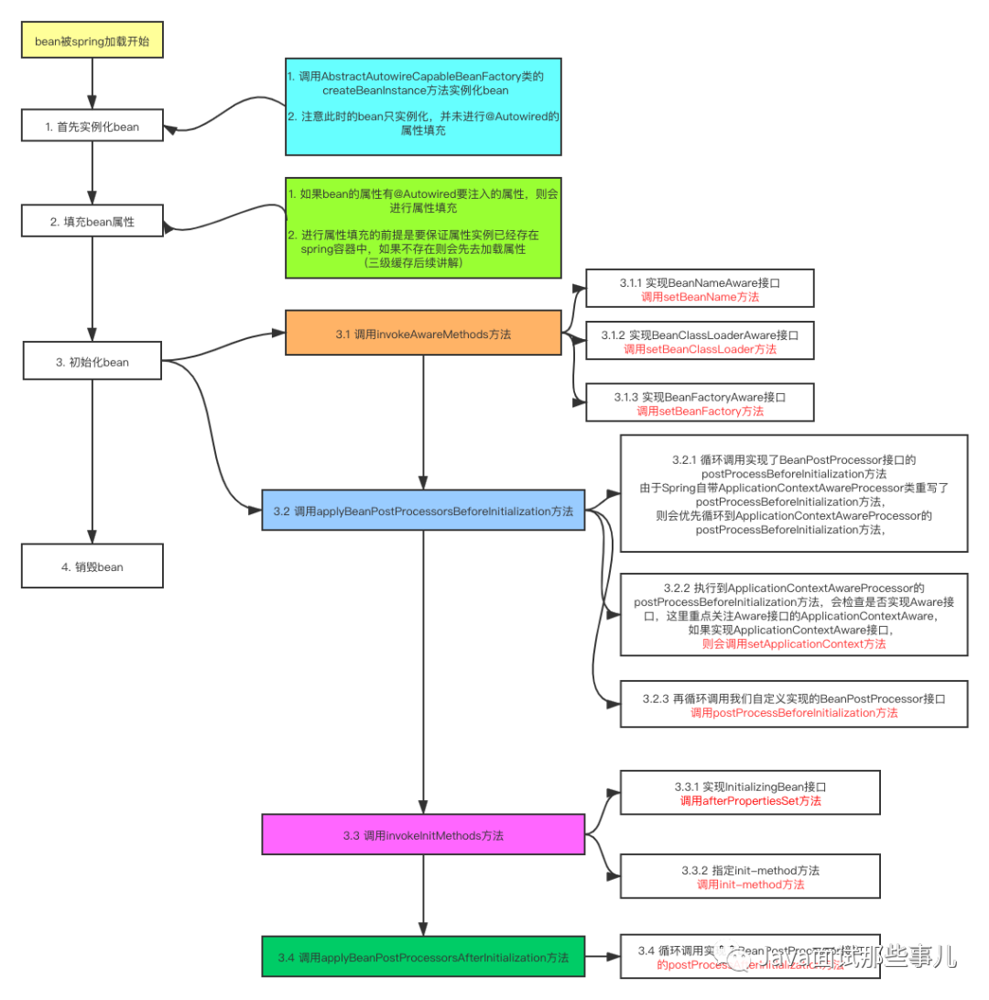

# 一、Spring相关
### 1、Spring的MVC原理和实现
Spring的Web MVC框架的DispatcherServlet的请求处理流程说明如下图：


### 2、Spring的IOC原理和实现，bean是如何管理起来的，以及它的生命周期
首先加载注解或者配置文件，形成BeanDefinition类，并将他们存入一个map，然后才到下面的流程。


3、Spring的AOP原理和实现
4、Spring AOP事务不生效有可能是什么原因
5、jdk的aop和aspectj的aop有什么区别
6、Springboot的开发的优势


### 7、Springboot的starter的原理和实现
Spring Boot 在启动的时候会干这几件事情：
1. Spring Boot 在启动时会去依赖的 Starter 包中寻找 resources/META-INF/spring.factories 文件，然后根据文件中配置的 Jar 包去扫描项目所依赖的 Jar 包。
2. 根据 spring.factories 配置加载 AutoConfigure 类
3. 根据 @Conditional 注解的条件，进行自动配置并将 Bean 注入 Spring Context

resources/META-INF/spring.factories文件的写法很简单，是一个key=value的形式，key是接口的全路径，value是对应实现类的全路径，如果value存在多个实现，用英文逗号分隔。
``` xml
# PropertySource Loaders
org.springframework.boot.env.PropertySourceLoader=\
org.springframework.boot.env.PropertiesPropertySourceLoader,\
org.springframework.boot.env.YamlPropertySourceLoader
```

总结一下，其实就是 Spring Boot 在启动的时候，按照约定去读取 Spring Boot Starter 的配置信息，再根据配置信息对资源进行初始化，并注入到 Spring 容器中。这样 Spring Boot 启动完毕后，就已经准备好了一切资源，使用过程中直接注入对应 Bean 资源即可。

这其实是一个SPI(Service Provider Interface)机制的变体，SPI可以在META-INF/services配置接口扩展的实现类，springboot中原理类似，只是名称换成了spring.factories而已。


8、Springboot自动配置那块是怎么实现的？底层代码逻辑
9、配置依赖如何处理？(配置有先后顺序，并且后面依赖于前面的)
10、Spring属性的配置如何管理？
11、Spring SPI机制
12、SpringCloud的优势，有哪些组件，分别是什么，做什么的？
13、有做无感发布吗？微服务里怎么实现的？
14、Spring事务传播机制

# 二、jvm
类加载机制
1、双亲委派机制
2、有没有什么办法替换JDK源码的初始化？项目中有没有做过？
3、类加载过程

# 三、JVM内存布局
1、JVM内存分布，堆、虚拟机栈、本地方法栈、程序计数器、元空间
2、JVM内存布局里本地变量表了解吗？
3、JVM问题排查过程
4、一个栈桢对应一个线程吗？
5、栈桢对返回值和入参做了什么优化
6、JAVA创建一个对象的过程，是如何分配内存的？(是否要加锁)

# 四、垃圾回收
1、并发标记中如何解决漏标问题
2、触发GC有哪几种方式
3、对象有些情况会进入老年代？
4、讲一下CMS垃圾回收器
5、dump文件除了OOM会出现，平时如何获取dump文件？
6、实时查看jvm堆栈信息，详细的GC信息
7、gc垃圾回收算法cms和g1

# 五、java
## 基础
1、你们用的java版本？
2、java8的特性你在实际工作中有用过哪些？
3、函数式变成用的多吗？(除了lambda)
4、jdk的动态代理涉及哪些类
5、java怎么实现深拷贝
6、java浮点数存储会损失精度，以及BigDecimal

## 内存模型
1、java内存模型
2、volatile关键字的作用
3、happenbefore了解吗？
4、内存屏障

## 集合、线程池、锁、juc工具
1、java集合框架的认识(ArrayList、LinkedList、HashMap、ConcurrentHashMap、TreeMap、HasSet)
2、讲一下ArrayList、LinkedList的优缺点和使用场景，ArrayList使用的时候有哪些细节需要注意的？
3、HashMap的实现，put和resize方法如何实现的，以及1jdk1.7里的死循环问题？
4、线程池原理，参数，Executors各个线程池的特点。
5、线程池的线程空闲的时候在干啥
6、线程池的线程如果遇到异常没有捕获线程会怎样，系统会怎样？
7、fork/join是怎么实现的
8、讲一下BlockingQueue
9、java多线程的线程安全问题，如何解决
10、java加锁有哪几种方式

### 11、synchronized可以响应中断吗？
不可以，synchronized不会响应中断。

**响应中断的方法**：线程进入等待或是超时等待的状态后，调用interrupt方法都是会响应中断的，所以响应中断的方法：Object.**wait()**、Thread.**join**、Thread.**sleep**、LockSupport.**park**的有参和无参方法。

**不响应中断的方法**：线程进入阻塞状态后，是不响应中断的，等待进入**synchronized**的方法或是代码块，都是会被阻塞的，此时不会响应中断，另外还有一个不响应中断的，那就是阻塞在ReentrantLock.**lock**方法里面的线程，也是不响应中断的，因为中断被吃了，没有外抛。如果想要响应中断，可以使用ReentrantLock.lockInterruptibly方法。

### 12、synchronized是公平锁吗？
不是。其他信息参考[为什么synchronized是非公平锁_这一次，带你全面了解锁机制！](https://blog.csdn.net/weixin_39606638/article/details/110413494)

### 13、synchronized锁升级过程
synchronized在1.6以前是重量级锁，当前只有一个线程执行，其他线程阻塞。为了减少获得锁和释放锁带来的性能问题，而引入了偏向锁、轻量级锁以及锁的存储过程和升级过程。在1.6后锁分为了无锁、偏向锁、轻量锁、重量锁，锁的状态在多线程竞争的情况下会逐渐升级，只能升级而不能降级，这样是为了提高锁获取和释放的效率。


其他信息参考[Synchronized原理](https://juejin.cn/post/6844903670933356551)

### 14、如何关掉synchronized的偏向锁
偏向锁有点像可重入锁的意思，如果是同一个线程过来，直接通过。自JDK1.6后默认启用。
* **开启：**-XX:+UseBiasedLocking
* **关闭：**-XX:-UseBiasedLocking
还有一个参数是**-XX:UseBiasedLockingStartupDelay=0**, 默认是5秒后启用，这里可以设置为0，立即启用。

15、锁如何实现公平？
16、ReentrantLock实现
17、AQS的实现原理和代码，里面都有什么队列，condition的应用讲一下
18、concurrenthashmap的实现，为什么1.8不用分段锁了？
19、countdownlatch底层实现
20、如何实现无锁的线程安全
CAS

# 六、redis
1、redis数据类型及底层实现

### 2、Redis网络架构及单线程模型
Redis一般被看作单进程/单线程组件，因为Redis的网络IO和命令处理，都在核心进程中由单线程处理。

Redis基于Epoll事件模型开发，可以进行非阻塞网络IO，同时由于单线程命令处理，整个处理过程不存在竞争，不需要加锁，没有上下文开销，所有数据操作都在内存中。

核心线程除了负责网络IO及命令处理外，还负责写数据到缓冲区，以方便将最新写操作同步到AOF、slave。除了核心线程，还有3个辅助BIO线程，分别负责文件关闭、将AOF缓冲刷入磁盘、清理对象。

### 3、redis的数据结构讲一下
数据结构有String、List、Hash、Set、ZSet、Bitmap等，他们底层对应的存储结构是sds、dict、ziplist、quicklist和skiplist。
其中String、Bitmap对应的是sds，List对应的是quicklist。Set用dict存储。
Hash在数量小(512)长度短(64)的时候用的是ziplist，超过了用dict。
ZSet在数量小(128)长度短(64)的时候用的是ziplist，超过了用skiplist。

### 4、ziplist为什么节省空间，rehash过程是什么。
ziplist是去除了前后的指针，来达到以节省空间的。所以ziplist要求内存地址是连续的，通过头尾地址，元素数量来定位元素。

### 5、讲一下skiplis，为什么用skiplist而不是红黑树？
skiplist和红黑树在实际使用的时候，效率差不多。但是使用skip还有两个原因：
1. 结构简单，易于实现；红黑树虽然翻转已经很少，但是实现逻辑还是很复杂的。
2. 跳的步长天然地适合权重排序的场景

### 6、你用哪些redis命令，比如获取到redis set的长度？list的呢？
set：scard
list： llen

### 7、redis用的什么版本？讲一下redis部署模式的演进，单机，主从，哨兵，集群，为了解决什么问题，如何实现，特点。

### 8、如果在集群里多添加一个节点，redis会怎么做数据处理？
简单地说，就是需要执行redis命令迁移槽位。大概的过程是：
1. 计算好每个源节点需要向新节点迁移多少个槽位
2. 对目标节点发送cluster setslot{slot}importing{sourceNodeId}命令，让目标节点准备导入槽的数据
3. 对源节点发送cluster setslot{slot}migrating{targetNodeId}命令，让源节点准备迁出槽的数据
4. 在源节点上执行migrate{targetIp}{targetPort}""0{timeout}keys{keys...} 命令，把获取的键通过流水线（pipeline）机制批量迁移到目标节点，批量 迁移版本的migrate命令在Redis3.0.6以上版本提供，之前的migrate命令只能 单个键迁移。对于大量key的场景，批量键迁移将极大降低节点之间网络IO次数。
5. 重复执行步骤3）和步骤4）直到槽下所有的键值数据迁移到目标节点。
6. 向集群内所有主节点发送cluster setslot{slot}node{targetNodeId}命令，通知槽分配给目标节点。为了保证槽节点映射变更及时传播，需要遍历发送给所有主节点更新被迁移的槽指向新节点。

[【redis】集群伸缩（添加删除节点）](https://blog.csdn.net/tr1912/article/details/82390540)

9、redis集群如何防止超卖(数据同步问题)
10、redis的过期策略是怎样的，有哪些淘汰机制？是怎么发现key过期的？
11、redis的备份方式
1. aof
2. rdb快照
3. aof+rdb快照

12、AOF的重写机制

13、RDB快照时如何做到边做快照便提供服务，copyonwritte了解吗？
原数据操作系统层面的read-only，只能操作copy出来的备份。

14、redis各个节点之间是怎么进行通信的？用到什么协议？
Gossip协议通信，端口为redis对外服务端口+10000，如服务端口为6975，那么gossip端口为16975。
Gossip协议主要由meet、ping、pong、fail四种消息，其中meet、ping、fail的回应消息都是pong。

### 15、redis和mysql双写一致性问题
解决办法有以下几种
1. 设置redis缓存过期时间，保证最终一致性
2. 延时双删策略：先淘汰缓存, 再写数据库, 异步1秒后，再次淘汰缓存 这么做，可以将1秒内所造成的缓存脏数据，再次删除。

[Redis与Mysql双写一致性方案解析](https://www.cnblogs.com/liuqingzheng/p/11080680.html)

# 七、kafka
1、MQ的推和拉模式你是怎么理解的，本质区别是什么
2、如何保证消息中间件有序
3、有没有用过netty https://javadoop.com/post/netty-part-1
4、kafka原理机制讲一下
5、kafka数据消费异常如何处理
6、kafka从生产到消费的整个流程，怎么保证消息不丢失，会遇到哪些问题，怎么解决的，都讲一下

# 八、流量缓存
### 1、限流机制，源码原理？限流值是如何确定的？为了什么？
限流机制主要由漏斗法、令牌桶法。我们做的限流，分两个级别
1. nginx限制单个ip的并发请求数，原理是漏斗法。
2. 网关限制接口的请求，因为网关和后端app采用的是轮询算法，所以虽然是对单个pod的限流，但也实现了分布式限流的总数。原理是令牌桶法，具体是guava的RateLimiter。


### 2、7层负载均衡的原理？侧重讲一下应用层和传输层。

[lvs+nginx负载均衡](https://www.cnblogs.com/arjenlee/articles/9262737.html)
[负载均衡Nginx和F5的区别](https://www.cnblogs.com/baby123/p/11833048.html)

3、负载均衡?轮询后端权重怎么确定?如果希望根据连接数分配请求，你如何设计?
4、nginx有没有检测后台服务的功能？
5、Tomcat有多少并发/线程支持这600的QPS？
6、mybatis的缓存，有没有做过扩展？数据权限、数据监控、缓存？
7、为何要用caffeine？
8、guava和caffeine的区别
9、caffeine为何效率能提升
10、caffeine有没有用到什么问题？比如递归引用？
11、缓存穿透、击穿、雪崩三问，如何解决
12、缓存失效的几种场景，以及解决方案

# 九、数据库
## 架构方案
1、为何从MariaDB迁移到MGR？
2、有没有做过什么mysql优化
3、讲一下mysql的3个log
4、双活的数据同步是怎么做的？

## 事务级别
1、什么是acid，MySQL如何实现ACID
2、数据库事务级别，脏读、可重复度、幻读？
3、mysql事务隔离级别，acid中一致性的理解
4、mysql的隔离级别，所解决的问题
5、mysql可重复度的实现原理
### 6、mysql是如何实现可重复读的，和串行化实现上的区别是什么
mysql实现可重复读的方式：MVCC。具体过程是：
1. InnoDB在每行记录后面保存两个隐藏的列来，分别保存了这个行的创建时间和行的删除时间。这里存储的并不是实际的时间值,而是系统版本号。
2. 当数据被修改时，版本号加1。
3. 在读取事务开始时，系统会给当前读事务一个版本号，事务会读取版本号<=当前版本号的数据。此时如果其他写事务修改了这条数据，那么这条数据的版本号就会加1，从而比当前读事务的版本号高，读事务自然而然的就读不到更新后的数据了。

|  特性   | 含义  | 
|  ----  | ----  |
|  Atom  | 事务的一组操作是原子的不可再分割的，这组操作要么同时完成要么同时不完成。 |
| Consistency  | 事务在执行前后数据的完整性保持不变，数据库在某个状态下符合所有的完整性约束的状态叫做数据库具有完整性。 |
|Isolation|当多个事务同时操作一个数据库时，可能存在并发问题，此时应保证各个事务要进行隔离，事务之间不能互相干扰。|
|Durability|持久性是指一个事务一旦被提交，它对数据库中数据的改变就是永久性的，不能再回滚。|
要注意，Consistency是最终目的，其他三个特性都是围绕达成它来做的。比如，银行转账问题，A给B转100元。A要么少了100，然后B多了100，要么A没少，B也没多。不能出现A少了100，B也没多100，这就叫一致性。再举个例子，一个手机性能好，CPU强劲，内存反应快，指纹解锁快，那么这里的手机性能好，就相当于ACID里的C，一致性！

|事务级别|解决的问题|实现原理|
|----|----|----|
|Read Uncommitted|更新丢失，如果A事务已经开始写数据，B事务则不允许同时进行写操作，但允许其他事务读此行数据。|排他写锁|
|Read Committed|避免脏读取，就是A事务修改未提交，B事务读不到到A修改后的数据，A提交后，B可以读到|“瞬间共享读锁”和“排他写锁”|
|Repeatable Read|解决不可重复读取，也就是说A多次读取数据都是一样的，不管B是否是否已经修改了对应的数据|MVCC+next-key lock|
|Serializable|解决幻读，一个 select 语句执行了两次，但是在第二次返回了第一次没有返回的行,那么这些行就是“phantom” row|所有select都加了for update|

### 7、mysql有哪些锁
行锁、表锁、间隙锁、next-key锁、意向锁，其中next-key锁是由行锁和间隙锁组成的。

## 分库分表
1、分表分库，路由策略
2、分表用的工具sharing-jdbc，源码原理，如何做的分库表表
3、分表下的扩容怎么做？
4、热点数据导致分表不均匀如何处理
5、分表的表数目要扩大一倍如何做？

## 分页
1、mysql分页查询的原理，实现机制，如何避免分页查询越来越慢
2、mysql分页是如何实现的？深度分页？回表？

### 3、mysql分页查询查第1000_0000到1000_1010条，是从第一条往前查吗？有什么优化手段
采用书签法，每一次传入上一次的最大的主键，然后以此为基准将limit 1000_0000, 10变成limit 0, 10。
不过这种方案有局限：
1. 主键必须是自增的
2. 分页距离过大还是会很慢
3. 往前翻页还是会很慢
针对这三个问题，第1个没什么好说的，主键自增，可以做这个要求，自增的主键对范围查询是友好的。

第2个问题，直接在页面不给跳转分页的入口，只给相对分页，相对分页可以算出距离差，性能也很好。

第3个问题，往前翻页，需要做缓存，把相同条件的页码查询的最大主键做缓存，如果遇到往前分页，需要先查找到前面最近的一次分页查询，并计算出增量。

## 慢查询
1、什么是慢查询，有慢查询优化经验吗？
2、数据库索引不合理的表象是什么？如何定位分析慢sql

## 索引
1、mysql常用的引擎
2、mysql的索引结构、数据存储结构
3、如何判断一个索引是否合理？或者说你是如何考虑要建一个索引的？
4、说一下B树和B+树的区别
5、3阶B+树能存多少数据？
6、来写个sql，找出用户数最多的topk个城市（我sql写的很少，只了解理论，所以硬着头皮乱写了一下）
7、给了一个建立了主索引和二级索引的表（InnoDB），where条件命中二级索引，问总共走了几次索引
8、mysql索引优化。https://tech.meituan.com/2014/06/30/mysql-index.html
9、SQL聚合查询语法
10、B+树的每个节点存储的什么
11、MyISAM主键索引和普通索引保存的都是数据指针。
12、Innodb 聚集索引保存的是数据，普通索引保存的是主键。
13、为什么用b+tree呢，范围查询友好，有指向邻接点的指针。磁盘IO更少，层次更少。
14、mysql有哪些索引，什么叫回表？
15、索引的最左匹配原则是什么？
16、索引失效场景和最左匹配原则

# 十、问题定位
1、抢购系统压力比较大，大在哪里？什么量级？系统有没有遇到什么问题，怎么定位解决的？
2、如果CPU达到100%，应该如何定位
3、压测出现的问题，如何解决
4、线上问题如何处理？
5、如何做性能调优？
6、现在系统出现一种卡顿、慢，你如何定位？
7、多线程的问题排查过程
8、现场发现一个服务请求特别慢，CPU特别高，如何定位？
9、如何定位发现死锁？
10、微服务如何定位问题？
### 11、系统一直频繁fullGC但是没有oom，这种问题如何定位？
fullgc有两种可能，一种是分配的对象太多了，导致多次叠转后进入老年代的对象过多，另外一种是代码调用System.gc。
如果没有OOM，说明内存不是一直递增的，有回收。信息还不够，需要继续定位。
1. 在目标机器上执行**java -XX:PrintCommandLineFlags -version**查看配置的JVM启动参数，主要关心堆空间新老层大小和比例的分配，老年代晋升的设置，以及确认是什么垃圾回收算法
2. 如果1的方法无法看到，那么说明用的是默认配置，也可以用**java -XX:PrintFlagsFinal -version**查看默认配置
3. 使用jstat命令查看当前gc情况，**jstat -gc {pid}**，主要关注MinorGC和FullGC的次数，耗时，各部位的大小
4. 使用jstat命令查看当前gc的可能原因，**jstat -gccause {pid}**，如果看不出什么来，可以在末尾加个时间持续打印观察，如：**jstat -gc {pid} 100**，100毫秒打印一次，如果gfullc频繁，应该可以看到GCC下打印的字段，要么的内存分配失败，要么是在调整，要么是System.gc。如果是System.gc，那么需要查看代码，看哪里调用了System.gc，搜索代码的时候，可以把三方包的代码也加上，防止是因为三方包的代码导致的。如果是分配内存失败导致的fullgc，那么需要重新观察堆各个部分的大小和增长速度。
5. 4中如果是内存分配失败，那么说明存在一直创建的对象，这个时候，需要用jmap打出多个时间段的dump文件，然后使用MAT工具对比查看哪部分的对象多。
6. 根据前5步，应该能基本定位到对应代码，这个时候专心看代码。
7. 有一定的想法后，在测试环境复现，并修复，方案ok后，同步到生产。

# 十一、设计模式与算法
1、讲几个你熟悉的设计模式
2、1000万条正整数，如何拿到最大的或者最小的5个
3、快速排序的实现原理
4、笔试题，两个线程，A只打印数字，B只打印字幕，交替打印出字符串“12A34B45C”
5、每个客户的银行卡会同时存在多种交易，取现、存款、转账等，写一个同行银行卡转账的思路，A转账给B(提示：考虑并发、死锁、单数据库、多应用实例执行)
6、百亿数据求中位数
7、hash冲突
8、一亿个qq号存储查找
9、10亿个url 4g内存去重
10、用两个栈实现队列，问我怎么优化
11、100万的关键字中找到某个字符串
12、快排
13、给一个能随机产生1到10000的函数，如何能让它产生随机1到7000；
14、给一个函数，返回 0 和 1，概率为 p 和 1-p，请你实现一个函数，使得返回 01 概率一样。
15、KV的数据结构，要求内部有序（我：B+/红黑/堆+哈希表）
16、来写个题：判断一个二叉树是否为完全二叉树
17、来写个题：求两个班成绩的最小差值
18、给一个数组，代表一个数字比如[3,1,4,5,2]代表31452，让你删除k个数字，使得留下来的值最大，返回这个最大值
19、通过前序中序重建二叉树输出后序
20、翻转二叉树，找到二叉树两个节点的最短距离
21、1T文件，每一行都是一个数字，求出现次数最多的topK 
22、链表两两反转 In:1→2→3→4→5 Out:2→1→4→3→5
23、用层序遍历数组输出中序遍历（递归和非递归）
24、将N个有序数组（每个长度为M）排序成一个有序数组（优先队列或归并），并问了复杂度
25、我们有一系列公交路线。每一条路线 routes[i] 上都有一辆公交车在上面循环行驶。
例如，有一条路线 routes[0] = [1, 5, 7]，表示第一辆
(下标为0) 公交车会一直按照 1->5->7->1->5->7->1->... 的车站路线行驶。
假设我们从 S 车站开始（初始时不在公交车上），要去往 T 站。
期间仅可乘坐公交车，求出最少乘坐的公交车数量。返回 -1 表示不可能到达终点车站
输入：
routes = [[1, 2, 7], [3, 6, 7]]
S = 1
T = 6
输出：2
解释：
最优策略是先乘坐第一辆公交车到达车站 7, 然后换乘第二辆公交车到车站 6。

26、多个有序单链表归并为一个有序链表，要求不能自己建立新节点，复杂度NlogN
27：堆排序熟悉吗？实现堆排序插入的函数
28、三个数组的归并排序
29、查找一个字符串中无重复字符的最长子串。
30、单链表排序
31、在一个二维字符数组中，查询指定单词。
32、过滤词实现
33、两个人抛硬币，先抛到正面的赢，问先后手的胜率是多少。
34、假设你正在爬楼梯。需要 n 阶你才能到达楼顶。每次你可以爬 1 或 2 个台阶。你有多少种不同的方法可以爬到楼顶呢？

# 十二、通信协议
http
1、讲讲HTTP协议？请求行、请求头、请求体，请求体的结构他们通过什么分隔符来分隔的。
2、http返回码有几类？
3、http返回码301和302的用处和区别？
4、说一下HTTPS的访问过程，协议是如何建立起来的
5、HTTPS建立连接的过程中交换了多少个随机数

## tcp/udp
1、TCP对比UDP，直播为什么用udp不是tcp
2、TCP的滑动窗口和拥塞
[TCP的滑动窗口与拥塞窗口](https://blog.csdn.net/ligupeng7929/article/details/79597423)
3、tcp的粘包和半包
4、TCP三次握手详细过程？SYN攻击底层原理是什么？（要答到内核的半连接队列）
5、TCP四次挥手TIME_WAIT状态作用？为什么是2MSL？MSL和TTL什么关系？
6、服务器大量TIME_WAIT状态，危害是什么？
7、TCP的MSL生命周期怎么控制的，怎么确定MSL的时间
8、服务端出现大量close_wait原因（主子进程共享socket，close不能完全关闭）
9、你提到了优雅关闭tcp连接，说一下shutdown和close？

## 请求链路
1、浏览器访问baidu.com的过程
2、ping实现
3、服务端在调用listen之后调用sleep，客户端connect之后会返回错误吗
4、服务端一直阻塞着(调用sleep)，客户端调用send会返回错误吗？
5、IP 地址子网划分
6、DNS 解析过程
7、查看端口占用ps -aux | grep netstat -anp | grep ***


# 十三、项目架构相关
1、工作中的挑战，架构负责还是业务复杂，并发比较大，流量比较高，简历没体现？
2、挑一个你觉得做得还可以的项目讲一讲
3、平时工作中用到的技术栈，这些技术栈都起到什么作用
4、你们系统目前的并发有多少？
5、说一下抢购的设计流程、架构
6、防止非法抢购请求，你们都做了什么措施？
7、你现在负责哪个系统？
8、你们的双活是怎么做的？(面试官关注数据源)
9、抢购系统做了什么优化，解决了什么问题？
10、多选提交，后台代码怎么处理？
11、平时如何保证代码质量？
12、日志级别开的什么级别？
13、抢购系统对性能损耗最大的在哪里？
14、抢购现在还能优化吗？
15、抢购为何要分多个步骤？(削峰填谷)
16、抢购的技术架构
17、你们抢购的数据量有多大？
18、讲讲你们的技术架构
19、工作强度大有加人吗？
20、你们这个中台的工作流程是怎么样的？业务逻辑需要开发分析吗？
21、抢购重构做了哪些？
22、架构重构中遇到了什么问题？(面试官主要是想问你遇到的难题，如何解决的)
23、比较难设计实现需求
24、你们如何写测试用例的？(有没有不用启动Springboot作测试用例)
25、你觉得做的比较好的项目
26、讲一下华为OSS的性能和告警是怎么实现的
27、营销系统的架构设计
28、接口如何实现幂等
29、你们订单如何生成唯一id
30、工作中遇到比较困难的问题，怎么解决的？技术上的，网络上的，jvm上面的
31、什么是CAP
32、分布式系统优缺点，一致性是如何保证的
33、加强版：令牌桶，加上随时间滑动的要求，即：限制用户在任一连续的一小时内，不能超过5W的请求。这边提到了说将一小时分成多格，比如60格这样的，面试官点头貌似同意了，然后就实现代码了，包括协程异步更新时间窗口；
34、如何判断一个pod是否需要加内存？或者一个微服务是否需要加pod？
35、spring事物传播 16位设计一个分布式可靠的uuid

# 十四、发散性问题
1、为什么想换工作？对我们公司有了解吗？
2、为何从华为/中信跳出来？
3、你对自己未来的规划？
4、你的长处？要么是技术比较强，要么是沟通能力比较强！设计模式，设计理念，开源技术栈的了解！
5、最近在专业学习上有看什么书籍？(这个问题是为了接下来问你技术)
6、离职初衷是什么？
7、平时有没有学习一些知识用到工作场景

# 十五、操作系统及系统内核部分
1、说下多进程服务器，多线程服务器，协程服务器各种优势场景以及缺陷?
2、进程线程区别?你刚才说线程切换代价小，具体小在哪?
3、零拷贝
4、你知道的影响server并发的内核参数有哪些？TCP选项有哪些？描述一下
5、讲讲IO模型？
6、IO模型了解吗？讲下select/poll/epoll？各自优劣、底层实现、使用场景？
7、epoll实现原理，和poll的对比
8、CPU寻址过程，cache miss,TLB,页表...
9、在linux上执行ls操作系统做了什么（这个在6.S081上看过，刚好会，哈哈）
10、traceroute tcpdump ss strace lsof netstat grep ping iotop
11、虚拟内存
12、进程如何保持同步
13、进程间的通信（还进阶考了fork等代代码题）
14、ipc 线程同步
15、fork
16、有名管道和无名管道
17、进程线程
18、线程私有栈
19、进程间传递fd
20、磁盘转一次要多久
21、进程虚拟地址布局
22、内核创建进程和线程
23、fork之后父进程和子进程的栈变量是私有还是公有，堆变量呢，全局变量呢，常量呢，static 变量呢；
24、用mmap将共享内存映射到进程的虚拟地址空间时有没有分配物理内存，什么时候才真正分配物理内存给共享变量
25、硬链接和软连接区别；
26、kill 用法，某个进程杀不掉的原因（进入内核态，忽略 kill 信号）；
27、linux 用过的命令；
28、系统管理命令（如查看内存使用、网络情况）find awk
29、缺页中断？OS会干什么？linux系统怎么看缺页中断
30、那发现运行着tcp服务器的系统发生大量缺页中断，可能的原因是什么？
31、说到了io模型，那介绍下IO模型有哪些?epoll知道吗?详细介绍一下
32、epoll使用场景?select具体性能消耗在哪?
33、epoll需要拷贝文件描述符吗？
34、描述下nginx多进程模型?为什么用多进程?(master +多worker，master负责fork出子进程并listen，子进程accept)
35、进程和线程区别
36、程序计数器作用，为什么是私有的
37、select、poll、epoll，说下详情，各自的优缺点
38、边缘触发和水平触发区别，边缘触发的IO应该怎么写
39、delete、new和malloc、free的关系
40、 惊群是什么意思，怎么解决。

1. [对于Java线程中断的理解，哪种情况下会响应中断？哪种情况下不响应中断？](https://blog.csdn.net/qq_35634181/article/details/106769113)
2. [为什么synchronized是非公平锁_这一次，带你全面了解锁机制！](https://blog.csdn.net/weixin_39606638/article/details/110413494)
3. [Synchronized原理](https://juejin.cn/post/6844903670933356551)
4. [面试问题聚集](https://mp.weixin.qq.com/s?__biz=MzI4Njc5NjM1NQ==&mid=2247488811&idx=3&sn=b04d8fdacf575c7ec959de4107f31091&chksm=ebd62a07dca1a31186f7f62de60ba7c7a88db26233562ed7183c6f609c5e7f4ffb448f30375f&scene=21#wechat_redirect)
5. [Comparing Two High-Performance I/O Design Patterns](https://www.artima.com/articles/io_design_patterns.html)
6. [再谈select, iocp, epoll,kqueue及各种I/O复用机制](https://blog.csdn.net/shallwake/article/details/5265287)
7. [redis-cluster核心原理分析：gossip通信、jedis smart定位、主备切换](https://blog.csdn.net/R_P_J/article/details/78813265)
8. [Redis学习 redis节点之间的通信(十六)](https://blog.csdn.net/a1173537204/article/details/103376495)
9. [Cache Aside Pattern](https://blog.csdn.net/z50l2o08e2u4aftor9a/article/details/81008933)
10. [死磕nginx系列--nginx 限流配置](https://www.cnblogs.com/biglittleant/p/8979915.html)
11. [开发高并发系统时保护系统的三把利器：缓存、降级和限流](https://blog.csdn.net/zc529739024/article/details/78744876)
12. [MySQL可重复读隔离级别的实现原理](https://www.cnblogs.com/lmj612/p/10598971.html)
13. [深入浅出聊一聊mysql中的事务及其实现原理](https://blog.csdn.net/a3961401/article/details/110875387)
14. [Java面试题精选](https://mp.weixin.qq.com/s?__biz=MzIyNDU2ODA4OQ==&mid=2247485351&idx=2&sn=214225ab4345f4d9c562900cb42a52ba&scene=21#wechat_redirect)
15. [唯品会一面：Spring 为何需要三级缓存解决循环依赖，而不是二级缓存？](https://mp.weixin.qq.com/s/u9Sm_ezjbCWrmxCZ0y0f8Q)