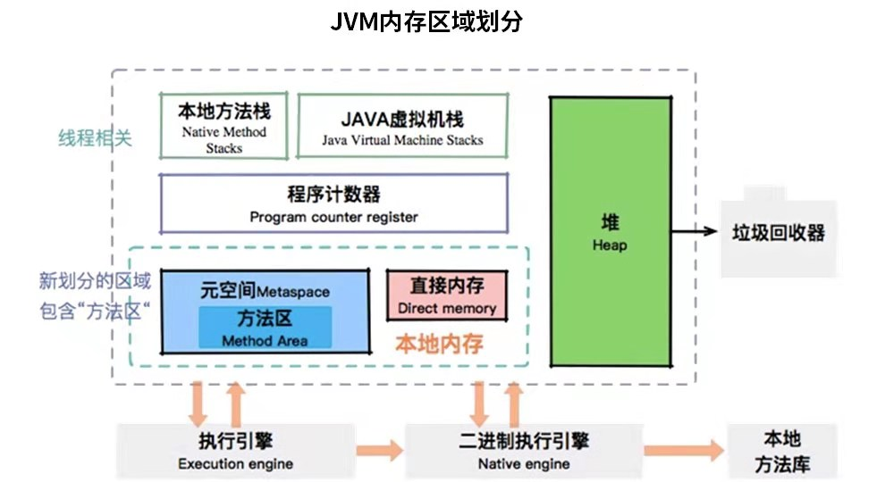
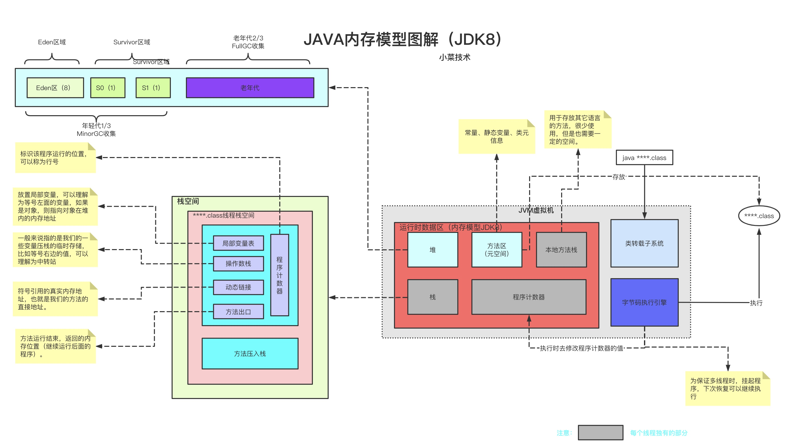
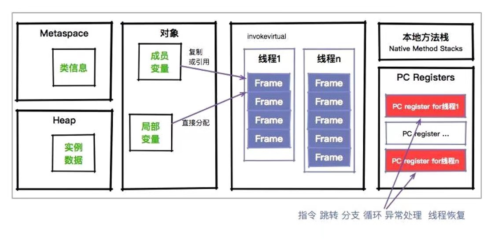
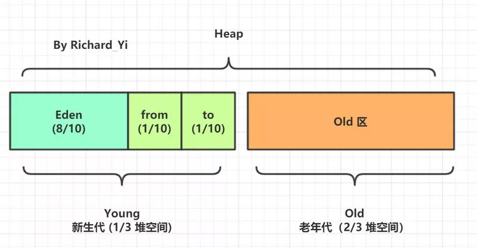

这里讨论的Java内存模型是一个广义的概念，分为两部分，一部分是JVM存储内存模型，另一部分是Java并发内存模型。前者和数据存储相关，后者主要和多线程相关。

# 一、JVM存储内存模型
先看两个图

JVM存储内存模型图一


JVM存储内存模型图二


JVM存储内存模型图三


充分阅读以上三个图，从不同角度建立JVM存储内存模型在脑海中的记忆。
有以下这些区域：堆、虚拟机栈、本地方法栈、元空间、程序计数器、直接内存。

如果从线程的角度来看，又可以分为线程共享和线程私有两类。
线程私有：
* 程序计数器 pc register
* 虚拟机栈 vm stack
* 本地方法栈 native stack

线程共享的：
* 堆   heap
* 元空间  metaspace
* 直接内存 direct memory

## 1 元空间
元空间就是JVM规范里的[方法区](https://docs.oracle.com/javase/specs/jvms/se8/html/jvms-2.html#jvms-2.5.4)概念的实现。

用于存储Java字节码信息，分为：
* Klass Metaspace
* NoKlass Metaspace

### 1.1 方法区的位置
在jvm1.7的时候，存在一个方法区，它是在堆里的，但是1.8把这一块内容移除了堆。

[Where Has the Java PermGen Gone?](https://www.infoq.com/articles/Java-PERMGEN-Removed/)

### 1.2 Klass Metaspace
Klass存放的是类信息，就是class文件在jvm里的运行时数据结构。这部分默认放在Compressed Class Pointer Space中，是一块连续的内存区域，
紧接着Heap，和之前的perm一样。通过-XX:CompressedClassSpaceSize来控制这块内存的大小，默认是1G。
下图展示了对象的存储模型，\_mark是对象的Mark Word，\_klass是元数据指针。


Compressed Class Pointer Space不是必须有的，如果设置了-XX:-UseCompressedClassPointers，或者-Xmx设置大于32G，就不会有这块内存，这种情况下klass都会存在NoKlass Metaspace里。


### 1.3 NoKlass Metaspace
NoKlass Metaspace专门来存klass相关的其他的内容，比如method，constantPool等，可以由多块不连续的内存组成。

这块内存是必须的，虽然叫做NoKlass Metaspace，但是也其实可以存klass的内容，上面已经提到了对应场景。

NoKlass Metaspace在本地内存中分配。

### 1.4 内存管理
Metaspace VM使用一个块分配器(chunking allocator)来管理Metaspace空间的内存分配。块的大小依赖于类加载器的类型。

Metaspace VM中有一个全局的可使用的块列表（a global free list of chunks）。

当类加载器需要一个块的时候，类加载器从全局块列表中取出一个块，添加到它自己维护的块列表中。当类加载器死亡，它的块将会被释放，归还给全局的块列表。
块（chunk）会进一步被划分成blocks,每个block存储一个元数据单元(a unit of metadata)。Chunk中Blocks的是分配线性的（pointer bump）。这些chunks被分配在内存映射空间(memory mapped(mmapped) spaces)之外。在一个全局的虚拟内存映射空间（global virtual mmapped spaces）的链表，当任何虚拟空间变为空时，就将该虚拟空间归还回操作系统。

下面这幅图展示了Metaspace使用metachunks在mmapeded virual spaces分配的情形。


### 1.5 OOM
Metaspace一样会OOM的。
在metaspace中，类和其元数据的生命周期与其对应的类加载器相同，只要类的类加载器是存活的，在Metaspace中的类元数据也是存活的，不能被回收。
每个加载器有单独的存储空间，当GC发现某个类加载器不再存活了，会把对应的空间整个回收。因为正常情况下类加载器基本上不太可能被回收，所以metaspace垃圾回收的机会并不多。

::: tip
这里涉及到类加载器的结构和安全考虑的知识，一个类加载器的namespace涵盖它所有父加载器的namespace。
:::
更多细节和metaspace的结构，参考这篇javaloop翻译的外文[深入理解堆外内存 Metaspace](https://javadoop.com/post/metaspace)

## 2 虚拟机栈
与程序计数器一样，Java 虚拟机栈也是线程私有的，它的生命周期和线程相同，描述的是 Java 方法执行的内存模型，每次方法调用的数据都是通过栈传递的。每个线程创建时 都会创建一个java虚拟机栈，其内部保存着一个一个栈帧（stack Frame），对应着一次次java 方法的调用。

### 2.1 栈桢
更多内容参考另一篇文章[Java Stack Frame](./java-stack-frame.html?_blank)

### 2.2 栈的OOM
通过-Xss这个参数可以设置jvm每个线程的虚拟机栈的大小，默认值和平台有关（不同平台默认值不同），我们最常用的Linux64位服务器默认值好像是1024k。
* StackOverFlowError： 若 Java 虚拟机栈的内存大小不允许动态扩展，那么当线程请求栈的深度超过当前 Java 虚拟机栈的最大深度的时候，就抛出 StackOverFlowError 错误。
* OutOfMemoryError： 若 Java 虚拟机栈的内存大小允许动态扩展，且当线程请求栈时内存用完了，无法再动态扩展了，此时抛出 OutOfMemoryError 错误。

## 3 程序计数器
程序计数器是一块很小的空间，它的作用可以看做是当前线程所执行的字节码的行号指示器。

由上图可以看出，程序计数器也是因为线程而产生的，与虚拟机栈配合完成计算操作。

它有两个主要的作用：
1. 字节码解释器通过改变程序计数器来依次读取指令，从而实现代码的流程控制，如：顺序执行、选择、循环、异常处理。
2. 在多线程的情况下，程序计数器用于记录当前线程执行的位置，从而当线程被切换回来的时候能够知道该线程上次运行到哪儿了。

::: warning
程序计数器是唯一一个不会出现 OutOfMemoryError 的内存区域，它的生命周期随着线程的创建而创建，随着线程的结束而死亡。
:::

## 4 堆
是内存区域中最大的一块区域，被所有线程共享，存储着几乎所有的实例对象、数组。
Java 堆是垃圾收集器管理的主要区域，因此很多时候也被称做“GC 堆”。

### 4.1 堆内存分布
从内存回收的角度来看，由于现在收集器基本都采用分代收集算法，所以 Java 堆中还可以细分为：新生代和老年代。再细致一点的有 Eden 空间、From Survivor 空间、To Survivor 空间等。从内存分配的角度来看，线程共享的 Java 堆中可能划分出多个线程私有的分配缓冲区(Thread Local Allocation Buffer,TLAB，为了提高分配对象的效率)。不过无论如何划分，都与存放内容无关，无论哪个区域，存储的都仍然是对象实例，进一步划分的目的是为了更好地回收内存，或者更快地分配内存。


下图可以帮我们更好地理解堆对象是如何申请到内存存放起来的。


### 4.2 垃圾回收算法
堆是垃圾回收的主要的阵地，从serial到CMS，再到G1和ZGC，堆这里上演着丰富多彩的垃圾回收的故事。
更多请参考另一篇文章[Java Garbage Collection](./java-garbage-collection.html?_blank)

### 4.3 堆的OOM
-Xmx 的默认值为你当前机器最大内存的 1/4
-Xms 的默认值为你当前机器最大内存的 1/64
堆是最容易发生OOM的地方，拥有众多参数和调节手段。

更多堆的知识，可以访问[java堆](https://www.yuque.com/vpwpw5/wu5tdl/ymo5pp)

## 5 本地方法栈
和虚拟机栈所发挥的作用非常相似，区别是： 虚拟机栈为虚拟机执行 Java 方法 （也就是字节码）服务，而本地方法栈则为虚拟机使用到的 Native 方法服务。 

在 HotSpot 虚拟机中和 Java 虚拟机栈合二为一。

本地方法被执行的时候，在本地方法栈也会创建一个栈帧，用于存放该本地方法的局部变量表、操作数栈、动态链接、出口信息。
方法执行完毕后相应的栈帧也会出栈并释放内存空间，也会出现 StackOverFlowError 和 OutOfMemoryError 两种错误

## 6 直接内存
直接内存 (Direct Memory) 并不是虚拟机运行时数据区的一部分，也不是 Java 虚拟机规范中定义的内存区域。
但是这部分内存也被频繁地使用，而且也可能导致 OutOfMemoryError 异常出现，所以我们放到这里一起讲解。 
在 JDK 1.4 中新加入了 NIO (New Input/Output) 类，引入了一种基于通道 (Channel) 与缓冲区 (Buffer) 的 I/O 方式。
它可以使用 Native 函数库直接分配堆外内存，然后通过一个存储在 Java 堆中的 DirectByteBuffer 对象作为这块内存的引用进行操作。
这样能在一些场景中显著提高性能，因为避免了在 Java 堆和 Native 堆中来回复制数据。
显然，本机直接内存的分配不会受到 Java 堆大小的限制，但是，既然是内存，肯定还是会受到本机总内存 (包括 RAM 以及 SWAP 区或者分页文件) 大小以及处理器寻址空间的限制。
如果内存区域总和大于物理内存的限制，也会出现 OOM。


现在我们知道了JVM存储内存模型有堆、JVM栈、本地栈、程序计数器、元空间，也知道了直接内存和NIO的关系。

# 二、Java并发内存模型
老规矩，先上图。

JMM分为主存储器(Main Memory)和工作存储器(Working Memory)两种。
* 主存储器是实例位置所在的区域，所有的实例都存在于主存储器内。比如，实例所拥有的字段即位于主存储器内，主存储器是所有的线程所共享的。
* 工作存储器是线程所拥有的作业区，每隔线程都有其专用的工作存储器。工作存储器有主存储器中必要的拷贝，称之为工作拷贝(Working Copy)。

在这个模型中，线程无法对住存储器**直接**进行操作，只能通过主存进行交换。

那么这些内存区域都是在哪里存储的呢？如果非要和JVM的模型有个对应的话，你可以认为主存中的内容是Java堆中的对象，而工作内存对应的是虚拟机栈中的内容。
但是实际上，主内存也可能存在于高速缓存中，或者CPU的寄存器上；工作内存也可能存在于硬件内存中，所以我们不用太纠结其具体位置。

## 1 JMM模型的原子操作
为了支持JMM，Java定义了8种原子操作(Action)


### read(读取)
作用于主内存，它把变量从主内存传到线程的工作内存中，供后面的load动作使用

### load(载入)
作用于工作内存，它把read操作的值放入到工作内存中的变量副本中

### use(使用)
作用于工作内存，它把工作内存中的变量传递给执行引擎，每当虚拟机遇到一个需要使用这个变量的指令时，将会执行这个动作

### assign(赋值)
作用于工作内存，它把从执行引擎获取的值赋值给工作内存中的变量，每当虚拟机遇到一个给变量赋值的指令时，将会执行这个动作

### store(存储)
作用于工作内存，它把工作内存中的一个变量传提给主内存，以备后续的write操作使用

### write(写入)
作用于主内存，它把store传送的值放入到主内存的变量中

### lock(锁定)
作用于主内存，把变量标记为线程独占状态

### unlock(解锁)
作用于主内存，释放变量的独占状态

## 2 volatile
这个关键字有两个作用：
1. 防止指令重排
2. 内存可见性(即时刷新值到主内存)
我们重点关注第2个，使用了volatile关键字的变量，每当变量的值有变动时，都会把更改立即同步到主内存中；而如果某个线程想要使用这个变量，则先要从主内存中刷新到工作内存上，这样保证了最大的变量可见性。

但是需要注意的是volatile并不能保证资源绝对线程安全，高并发下还是有可能造成值错误。要保证资源的绝对线程安全，需要用synchronized、final和锁这种更重的保证可见性的方式。

那为什么volatile在jdk源码中还是应用很广泛呢？我认为是这种防止指令冲排和内存可见性可以以低于锁的成本，带来更好的并发体验。

更多volatile的资料，可以参考[volatile关键字的作用、原理](https://monkeysayhi.github.io/2016/11/29/volatile%E5%85%B3%E9%94%AE%E5%AD%97%E7%9A%84%E4%BD%9C%E7%94%A8%E3%80%81%E5%8E%9F%E7%90%86/)

## 3 happens-before原则
Java语言中默认的一些“有序”行为，也就是**先行发生(happens-before)**原则，这些可能在写代码的时候没有感知，因为它是一种默认行为。
下面的原则是《java并发编程实践》这本书中队一些法则的描述。

* **程序次序**：一个线程内，按照代码顺序，写在前面的操作先行发生于写在后面的操作
* **监视器锁定**：unlock操作先行发生于后面对同一个锁的lock操作
* **volatile**：对一个变量的写操作先行发生于后面对这个变量的读操作
* **传递规则**：如果操作A先行发生于操作B，而B又先行发生于操作C，即可以得出操作A先行发生于操作C
* **线程启动**：对线程start()的操作先行发生于线程内的任何操作
* **线程中断**：对线程interrupt()的调用先行发生于线程代码中检测到中断事件的发生，可以通过Thread.interrupted()方法检测是否发生中断
* **线程终结规则**：线程中的所有操作先行发生于检测到线程终止，可以通过Thread.join()、Thread.isAlive()的返回值检测线程是否已经终止
* **对象终结规则**：一个对象的初始化完成先行发生于它的finalize()方法的开始

## 4. 内存屏障
happens-before那么多的规则和特性，是靠什么保证的呢？没错，就是内存屏障。

内存屏障(Memory Barrier)用于控制在特定条件下的重排序和内存可见性问题。JMM内存屏障可以分为读屏障和写屏障，Java的内存屏障实际上也是上述两种的组合。Java编译器在生成字节码时，会在执行指令序列的适当位置插入内存屏障来限制处理器的重排序。

下面介绍这些组合

### 4.1 Load-Load Barriers
``` bash
load1
LoadLoad
load2
```
保证load1数据的装载优先于load2以及所有后续装载指令的装载。

对于Load Barrier来说，在指令前插入Load Barrier，可以让高速缓存中的数据失效，强制重新从主内存加载数据。

### 4.2 Load-Store Barriers
``` bash
load1
LoadStore
store2
```
保证load1数据的装载优先于store2以及后续的存储指令刷新到主内存。

### 4.3 Store-Store Barriers
``` bash
store1
StoreStore
store
```
保证store1数据对于其他处理器可见，优先于store2以及所有后续存储指令的存储。

对于Store Barrier来说，在指令前插入Store Barrier，能让写入缓存中的最新数据更新写入主内存，让其他线程可见。

### 4.4 Store-Load Barriers
``` bash
store1
StoreLoad
load2
```
在load2及后续所有读取操作执行前，保证store1的写入对所有处理器可见。这条内存屏障指令是一个全能型的屏障，它同时具有其他3条屏障的效果，而且他的开销也是4个屏障中最大的一个。

参考：
1. 李国 深入浅出Java虚拟机
2. [栈帧——深入理解Java虚拟机](https://blog.csdn.net/sdp1103285470/article/details/86754750)
3. [java8jvmmm-luoqiu.jpg](https://www.processon.com/u/5e996e37f346fb4bdd738ede)
4. [java8jvmmm-xaiocaijishu.jpg](https://www.processon.com/u/5d4a85dbe4b0f4c23d640654)
5. [Java Virtual Machine (JVM) Stack Area](https://www.geeksforgeeks.org/java-virtual-machine-jvm-stack-area/)
6. [通过栈帧简述方法运行过程](https://blog.csdn.net/weixin_46421629/article/details/106322721)
7. [The Java® Virtual Machine Specification Java SE 8 Edition](https://docs.oracle.com/javase/specs/jvms/se8/html/index.html)
8. [局部变量表中Slot复用对垃圾回收的影响详解](https://blog.csdn.net/yztfst/article/details/97043729)
9. [栈帧的内部结构--动态链接 (Dynamic Linking)](https://www.cnblogs.com/ding-dang/p/13051143.html)
10. [你真的了解try{ return }finally{}中的return？](https://www.cnblogs.com/averey/p/4379646.html)
11. [jvm 运行时区域](https://www.yuque.com/vpwpw5/wu5tdl/wg0290)
12. [JVM学习——元空间（Metaspace）](https://www.jianshu.com/p/a6f19189ec62)
13. [元空间和直接内存_图文并茂，傻瓜都能看懂的 JVM 内存布局](https://blog.csdn.net/weixin_39782709/article/details/111264160)