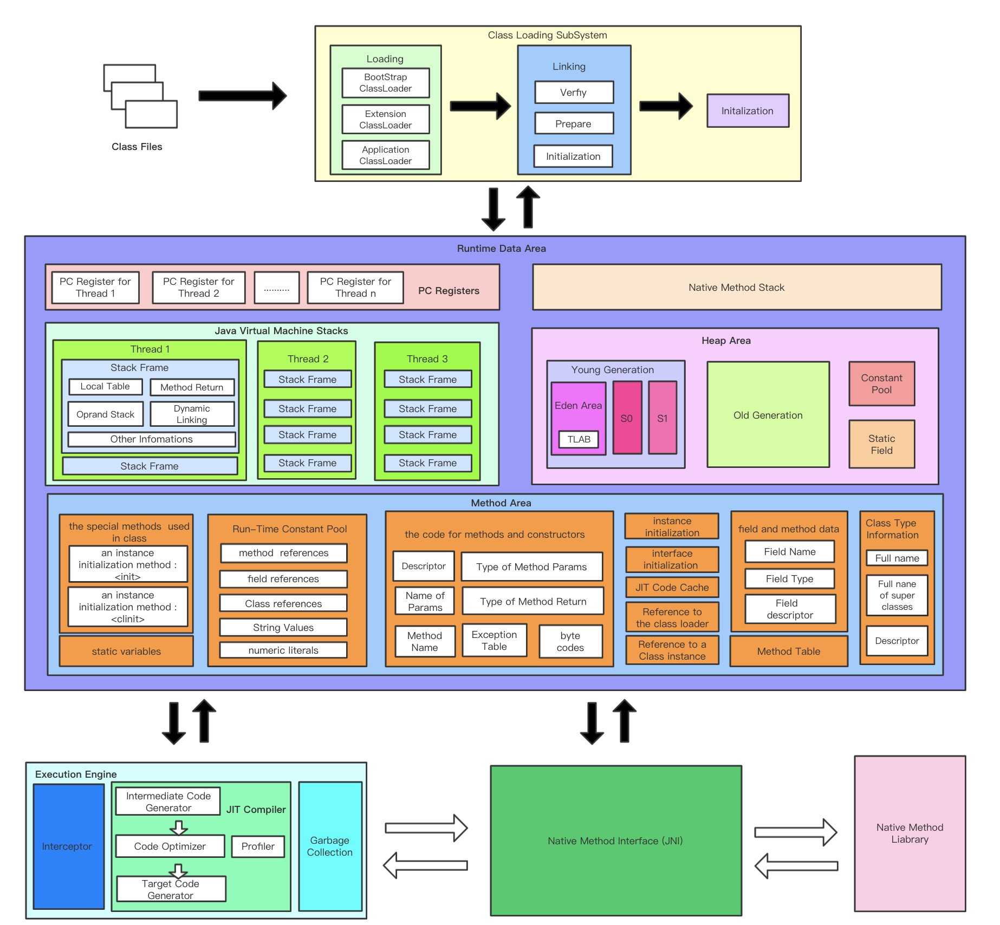
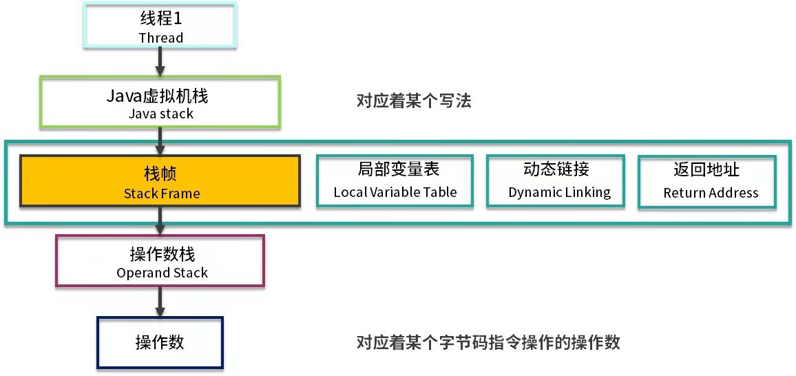

最近在学习李国的《深入浅出Java虚拟机》，结合02讲和18讲的内容，做一下笔记。
这里讨论的Java内存模型是一个广义的概念，分为两部分，一部分是JVM存储内存模型，另一部分是Java多线程内存模型。前者和数据存储相关，后者主要和多线程相关。

# JVM存储内存模型
JVM存储内存模型图一

JVM存储内存模型图二

JVM存储内存模型图三

充分阅读以上三个图，从不同角度建立JVM存储内存模型在脑海中的记忆。

## 栈桢
栈是一个先进先出的概念，包含java虚拟机栈和本地方法栈，他们的原理是类似的。

栈桢是指栈里的一批数据，它是函数的执行步骤集合。对于JVM来说，程序就是存储在方法区的字节指令码，我们所说的方法调用，就是指将方法的每一条指令压入栈，形成一个栈桢，然后一步步执行。栈桢执行完毕后，函数也执行完毕了。所有当前线程的栈桢都执行完毕出栈了，那么线程也就执行完毕了。

每个栈桢都包含4个区域：
* 局部变量表
* 操作数栈
* 动态链接
* 返回地址

### 局部变量表
局部变量表是一组变量值存储空间，用于存放方法参数和方法内部定义的局部变量。

*单位槽Solt*局部变量表的容量以单位槽为最小单位，虚拟机规范中并没有明确指定一个Solt应占的内存空间大小，只是说Solt应该可以存储下小于或者等于一个字节类型的数据。long和double类型是分割存储在多个单位槽的，这些资源是线程独占的，不会带来线程安全问题。

*填充顺序*先分配方法所在类的实例的引用“this”关键字（作为参数传入）接下来是其余的参数，参数表分配完毕后再根据方法体内部定义的变量顺序和作用域分配其余Solt。

*Solt空间重用*为了节省栈帧的空间，局部变量表中的Slot是可以重用的，方法体重定义的变量，其作用域不一定会覆盖整个方法体，如果当前字节码PC计数器的值已经超出了某个变量的作用域，那这个变量对应的Solt就可以交给其他变量使用。不过这样的设计除了节省栈空间以外还会伴随一些额外的副作用，例如在某些情况下，Solt复用会直接影响到垃圾收集器的行为。

我们知道了栈桢对应的是方法，而方法必然存在参数、返回值这些东西。但是我们都知道java是多线程的，那么栈桢执行如果遇到程序切换，该如何应对呢？我们接着往下看程序计数器的概念。

## 程序计数器
程序计数器是一块很小的空间，它的作用可以看做是当前线程所执行的字节码的行号指示器。

由上图可以看出，程序计数器也是因为线程而产生的，与虚拟机栈配合完成计算操作。程序计数器还存储了当前正在运行的流程，包括正在执行的指令、跳转、分支、循环、异常处理等。

参考：
1. 李国 深入浅出Java虚拟机
2. [栈帧——深入理解Java虚拟机](https://blog.csdn.net/sdp1103285470/article/details/86754750)
3. [java8jvmmm-luoqiu.jpg](https://www.processon.com/u/5e996e37f346fb4bdd738ede)
3. [java8jvmmm-xaiocaijishu.jpg](https://www.processon.com/u/5d4a85dbe4b0f4c23d640654)

