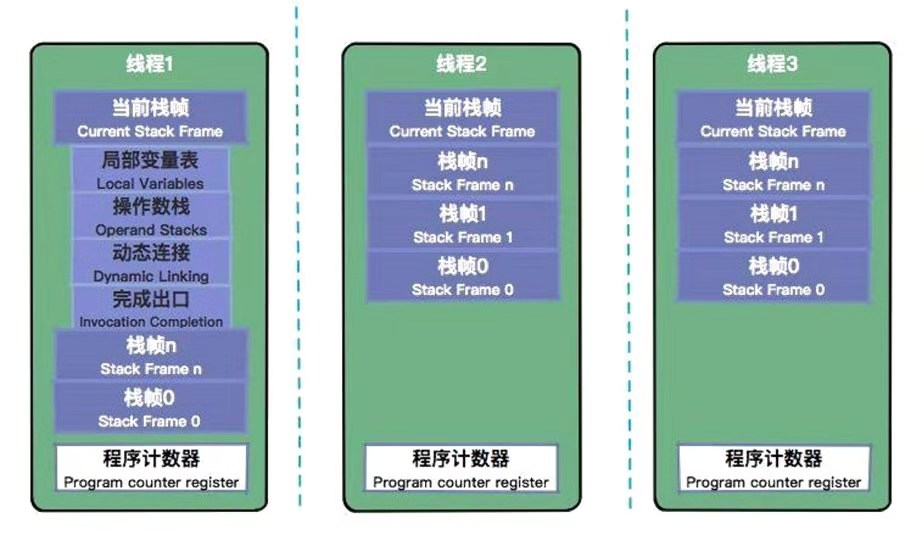

栈是一个先进先出的概念，包含java虚拟机栈和本地方法栈，他们的原理是类似的。
每一次函数的调用,都会在调用栈(call stack)上维护一个独立的栈帧(stack frame)。
对于JVM来说，程序就是存储在方法区的字节指令码，我们所说的方法调用，就是指将方法的字节信息，形成一个栈桢，然后通过操作数栈、局部变量表、程序计数器三者结合下一步步执行函数字节命令的过程。

::: tip
线程和程序计数器是同生共死的，他们通过操作封装好的栈帧来执行方法，达到程序目的。
:::
:::



每个栈桢都包含4个区域：
* 局部变量表
* 操作数栈
* 动态链接
* 返回地址

# 局部变量表(Local Variables)
局部变量表是一组变量值存储空间，用于存放方法参数和方法内部定义的局部变量。方法的Code属性的max_locals确定它的最大容量。

## 单位槽Solt
局部变量表的容量以单位槽为最小单位，虚拟机规范中并没有明确指定一个Solt应占的内存空间大小，只是说Solt应该可以存储下小于或者等于一个字节类型的数据。Hotspot是4bytes，int, float, 和引用占用一个槽位，long和double类型是分割存储在两个单位槽的，这些资源是线程独占的，不会带来线程安全问题。
``` java
// Class Declaration
class Example
{
    public void bike(int i, long l, float f, double d, Object o, byte b) {} 
}    
```


## 填充顺序
先分配方法所在类的实例的引用“this”关键字（作为参数传入）接下来是其余的参数，参数表分配完毕后再根据方法体内部定义的变量顺序和作用域分配其余Solt。

## Solt空间重用
为了节省栈帧的空间，局部变量表中的Slot是可以重用的，方法体重定义的变量，其作用域不一定会覆盖整个方法体，如果当前字节码PC计数器的值已经超出了某个变量的作用域，那这个变量对应的Solt就可以交给其他变量使用。不过这样的设计除了节省栈空间以外还会伴随一些额外的副作用，例如在某些情况下，Solt复用会直接影响到垃圾收集器的行为，比如复用后，原来引用的对象由于失去了栈这个GC Root，会被垃圾回收器即可收回。

## 局部变量重叠
在概念模型中，两个栈帧作为虚拟机栈的元素，相互之间是完全独立的，但是大多数虚拟机的实现里都会作一些优化处理，令两个栈帧出现一部分重叠。
让下栈帧的部分操作数栈与上面栈帧的部分局部变量表重叠在一起，这样在进行方法调用返回时就可以共用一部分数据，而无须进行额外的参数复制传递了，重叠过程如 下图：


关于局部变量表，有个很有意思的事情，请外出阅读[你真的了解try{ return }finally{}中的return？](https://www.cnblogs.com/averey/p/4379646.html)

# 操作数栈(Operand Stack)
操作数栈也是一个栈，它是方法字节命令真正执行的栈。
## 操作数栈工作示例
先入后出栈，临时存储运行时数据，由Code属性的max_stacks设定最大值。方法的每一行字节命令都在这里入栈出栈执行。可以看一下这个例子[通过栈帧简述方法运行过程](https://blog.csdn.net/weixin_46421629/article/details/106322721)。

## 栈顶缓存技术(Top-of-Stack Cashing)
基于栈式架构之间的区别，尽管基于栈式架构的虚拟机所使用的零地址指令更加紧凑，但完成一项操作的时候必然需要使用更多的入栈和出栈指令，这同时也就意味着将需要更多的指令分派（instruction dispatch）次数和内存读/写次数。由于操作数是存储在内存中的，因此频繁地执行内存读/写操作必然会影响执行速度。为了解决这个问题，JVM的设计者们提出了栈顶缓存（ToS，Top-of-Stack Cashing）技术，将栈顶元素全部缓存在物理CPU的寄存器中，以此降低对内存的读/写次数，提升执行引擎的执行效率。

简单地说，就是把寄存器计算的结果值不压回栈，而是继续出栈一条指令到寄存器中继续下一步的运算。


# 动态链接(dynamic link)
动态链接主要就是指向运行时常量池的方法引用，是为了支持当前方法的代码能够实现动态链接(Dynamic Linking)，符号引用转为直接引用。
栈桢的动态链接过程如下：
1. 当操作栈执行到这种调用的时候，会先找到所执行的对象的实际类型T
2. 在类型T中找到与常量中的描述符合简单名称都相符的方法，找到了的话，进行访问权限校验，如果通过则放回这个方法的直接引用，查找过程结束；如果不通过，则返回java.lang.illegalAccessError异常。
3. 2中如果在常量中没找到对应方法的话，按照继承关系从上往下依次对C的各个父类进行第2步的搜索和验证过程
4. 如果始终没有找到合适的方法，则抛出java.lang.AbstactMethodError异常

# 返回地址(returnAddress)
方法退出的过程实际上等同于把当前栈帧出栈，因此退出时可能执行的操作有：恢复上层方法的局部变量表和操作数栈，把返回值(如果有的话)压入调用都栈帧的操作数栈中，调用程序计数器的值以指向方法调用指令后面的一条指令等。


参考：
1. 李国 深入浅出Java虚拟机
2. [栈帧——深入理解Java虚拟机](https://blog.csdn.net/sdp1103285470/article/details/86754750)
3. [Java Virtual Machine (JVM) Stack Area](https://www.geeksforgeeks.org/java-virtual-machine-jvm-stack-area/)
4. [通过栈帧简述方法运行过程](https://blog.csdn.net/weixin_46421629/article/details/106322721)
5. [The Java® Virtual Machine Specification Java SE 8 Edition](https://docs.oracle.com/javase/specs/jvms/se8/html/index.html)
6. [局部变量表中Slot复用对垃圾回收的影响详解](https://blog.csdn.net/yztfst/article/details/97043729)
7. [栈帧的内部结构--动态链接 (Dynamic Linking)](https://www.cnblogs.com/ding-dang/p/13051143.html)
8. [你真的了解try{ return }finally{}中的return？](https://www.cnblogs.com/averey/p/4379646.html)
9. [jvm 运行时区域](https://www.yuque.com/vpwpw5/wu5tdl/wg0290)
10. [8.2.5 栈顶缓存（Top-of-Stack Cashing）技术](https://book.51cto.com/art/201504/472754.htm)


