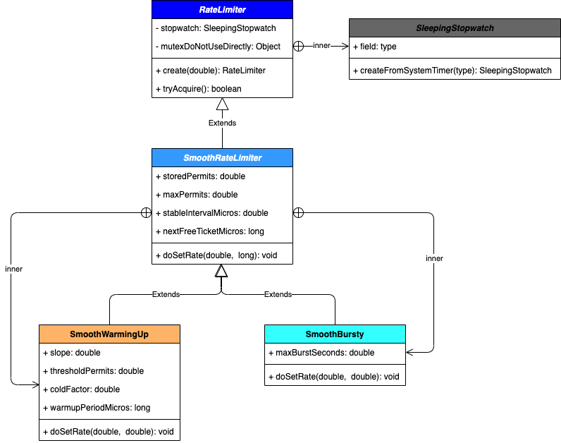

决定好好啃烂这块Guava的限流工具。
本文基于分析guava-19.0代码撰写。
下面先上一个简单的UML类图：



由上图可知，RateLimiter是顶层抽象类。主要有SmoothWarmingUp和SmoothBursty两种实现。

# RateLimiter
RateLimiter 是一个抽象类，它主要由创建方法create、获取方法acquire组成。create根据入参不同，返回的是不同的子类，这昭示了它还是个工厂类。不过这种父类直接做工厂类的方式，我还是第一次见，感觉耦合有点重。

## 类注释
一个限速器。
从概念上讲，限速器将按照配置进行限速。acquire()方法是一个阻塞方法，调用该方法会一直阻塞到获得限速器许可通过。

限速器通常用于控制资源的访问速度，这与信号量(Semaphore)相反，信号量限制并发访问的数量而不是速率（请注意，并发性和速率密切相关, 参考[Little's Law](http://en.wikipedia.org/wiki/Little%27s_law)）。

限速器主要的核心是限制速率。如果没有其他配置，将以固定的速率（以每秒的放行数来定义）分配许可证。许可证将平稳分配，并调整各个许可证之间的延迟，以确保维持配置的速率。可以将RateLimiter配置为具有预热期，在此期间内，每秒发出的许可证将稳定增加，直到达到稳定速率为止。

比如，我们有一堆任务需要执行，但是我们不希望一秒钟执行超过其中的2个任务。代码可以这样写：
``` java
final RateLimiter rateLimiter = RateLimiter.create(2.0); // rate is "2 permits per second"
void submitTasks(List<Runnable> tasks, Executor executor) {
    for (Runnable task : tasks) {
        rateLimiter.acquire(); // may wait
        executor.execute(task);
    }
}
```

又比如，假设我们产生了一个数据流，并且我们希望将其上限设置为每秒5kb。
``` java
final RateLimiter rateLimiter = RateLimiter.create(5000.0); // rate = 5000 permits per second
void submitPacket(byte[] packet) {
    rateLimiter.acquire(packet.length);
    networkService.send(packet);
}
```

重要的是要注意，所请求的许可永远不会影响请求本身的限制(如果速率限制是2，对aquire(1)的调用和对aquire(1000)的调用将导致完全相同的限制，都会被立刻放行)。但是会影响下一个请求，即，如果一个消耗很多速率的任务到达一个空闲的RateLimiter，它将立即被放行。但是下一个请求将受到限制，直到补足上一个放行导致的速率消耗。这叫**先上车后补票**！

另外，RateLimiter不提供公平保证。

## SleepingStopwatch
RateLimiter内部维持了一个同样是抽象的内部类SleepingStopwatch，用于计算时间流逝。这个类没有实现类，它是依靠createFromSystemTimer的无参静态方法直接返回一个匿名内部实现类出来供调用者使用。这个匿名内部类用StopWatch来作为计时工具，而StopWatch底层是通过System.nanoTime()来计时的。

StopWatch啥意思，你就把它当成秒表就行了，就是体育老师给我们测50米耗时，一按一个成绩的那种表。

我们看一下SleepingStopwatch的两个方法，sleepMicrosUninterruptibly和readMicros。

### sleepMicrosUninterruptibly 
底层是Thread.sleep方法，但是sleep过程不会响应中断。如果sleep过程中遇到中断， 先做个标记，sleep够时间后，再抛出中断。

### readMicros
此方法是利用Stopwatch实现类来实现的，返回流逝的时间，如下：
``` java
final Stopwatch stopwatch = Stopwatch.createStarted();

@Override
long readMicros() {
  return stopwatch.elapsed(MICROSECONDS);
}
```
调用此方法，需要在mutexDoNotUseDirectly的同步块内，防止时间的计算出现并发问题。

## 重要方法
### create
create方法是RateLimiter的工厂方法，用于返回对应的限速器。
* **create(double permitsPerSecond)** 返回一个SmoothBursty类似令牌桶限速器。这个限速器以秒为周期，释放*permitsPerSecond*个许可，此为限速器的速率。如果没有请求的时候，限速器会先预存1秒的许可(permitsPerSecond个)。当突发大流量来的时候(超过预存)，先放行，后续的请求将被要求等待足够长的时间，以弥补之前突发造成的速率不均衡问题，达到平滑过度(*译者感觉不是很平滑，如果前一个请求远远超过速率，后续请求会被限制得死死的，只不过是先上车后补票罢了，和一些贫困地区先借钱给天价彩礼，然后一辈子打工还钱颇有异曲同工之妙*)。
* **create(double permitsPerSecond, long warmupPeriod, TimeUnit unit)** 返回一个具有热身功能的，SmoothWarmingUp限速器。根据指定的稳定吞吐率和预热期来创建RateLimiter，这里的吞吐率是指每秒多少许可数（通常是指QPS，每秒多少查询）。在预热时间内，RateLimiter每秒分配的许可数会平稳地增长直到预热期结束时达到其最大速率（只要存在足够请求数来使其饱和）。同样地，如果RateLimiter 在warmupPeriod时间内闲置不用，它将会逐步地返回冷却状态。也就是说，它会像它第一次被创建般经历同样的预热期。返回的RateLimiter 主要用于那些需要预热期的资源，这些资源实际上满足了请求（比如一个远程服务），而不是在稳定（最大）的速率下可以立即被访问的资源。

create方法会调用静态方法createFromSystemTimer创建一个新的秒表(SleepingStopWatch)配合限速器使用。

### acquire 
``` java
  public double acquire(int permits) {
    // 检查要等多久才能获得足够的许可
    long microsToWait = reserve(permits);
    // 无中断地sleep
    stopwatch.sleepMicrosUninterruptibly(microsToWait);
    // 返回阻塞了多久才获得通过，单位秒
    return 1.0 * microsToWait / SECONDS.toMicros(1L);
  }
```
记住这是个阻塞方法，先计算需要阻塞多久才能获得足够许可，这里说的获得足够许可指的是填满之前的坑，因为都是先上车后补票的。
最后调用sleepMicrosUninterruptibly方法休眠后返回。

### reserve
``` java
  final long reserve(int permits) {
    checkPermits(permits);// 简单检查一下，permits > 0即可
    synchronized (mutex()) { //获取到互斥量，也就是锁。mutex()方法是一个经典的完美的单例方法，感兴趣的可以看一下源码
      // stopwatch.readMicros获取秒表开始到现在流逝了多久
      return reserveAndGetWaitLength(permits, stopwatch.readMicros());
    }
  }
```
reserve方法看起来没有做什么逻辑，我们继续往下看reserveAndGetWaitLength。

### reserveAndGetWaitLength
``` java
  final long reserveAndGetWaitLength(int permits, long nowMicros) {
    long momentAvailable = reserveEarliestAvailable(permits, nowMicros);
    return max(momentAvailable - nowMicros, 0);
  }
```
这个方法也很简单，就是计算之前的所有请求消耗了多久的时间momentAvailable(速率一定后，时间就是许可证的数量)，然后momentAvailable - nowMicros就是还需要等待多久能填平之前的坑。当然具体是填平之前的坑，还是把这次也算上，得看函数reserveEarliestAvailable是怎么实现的，很遗憾的是，这是个抽象方法，RateLimiter没有实现。

### tryAcquire
我们直接看最底层的*public boolean tryAcquire(int permits, long timeout, TimeUnit unit)*方法好了，其他tryAquire都是对它的参数组织调用。
``` java
 public boolean tryAcquire(int permits, long timeout, TimeUnit unit) {
    long timeoutMicros = max(unit.toMicros(timeout), 0);
    checkPermits(permits);
    long microsToWait;
    synchronized (mutex()) {
      long nowMicros = stopwatch.readMicros(); //按一下秒表，看过了多久了
      if (!canAcquire(nowMicros, timeoutMicros)) { // 判断是否能获取到permits个许可
        return false; //很明显不能
      } else {
        microsToWait = reserveAndGetWaitLength(permits, nowMicros); // 那就计算一下还需要阻塞多久能通行
      }
    }
    stopwatch.sleepMicrosUninterruptibly(microsToWait); //无中断地休眠够(速率定了后，足够的时间就是足够的许可证)
    return true;
  }
```
这个函数，是acquire的补充。tryAcquire先判断在一定时间内能否获取到足够的许可，不行的话，直接返回false了，不会进入阻塞。

canAcquire只有一行，很简单，不展开讲。它里面只有queryEarliestAvailable方法值得关注，但是也是抽象的。queryEarliestAvailable和reserveEarliestAvailable一样，是关于定义怎么样才算抹平之前的事儿的函数，需要在具体算法中具体实现。

最后，关于rate的设置也还有几个函数，如**doSetRate**和**doGetRate**，但是他们都是抽象类，后面再看了。
至此，RateLimiter代码阅读完毕，这里总结一下：
1. 用秒表来计时，底层用的是System.nanoTime()
2. 通过速率，实现了时间和许可证的转换，通过sleep换取足够的许可证产出。
3. 注意sleep是后响应中断的(后响应的意思是中断的时候继续睡，睡完了在把中断抛出，本文作者定义)。
4. 有一些工厂构造函数，会初始化一个秒表配合限速器一起用 
5. 有一些获取许可的方法，分为阻塞和半阻塞
6. 有一些设置和获取速率的抽象方法

# SmoothRateLimiter
SmoothRateLimiter还是一个抽象类，不过它里面有两个实现类。

## How is the RateLimiter designed, and why?
先硬翻一下这一大坨。

RateLimiter的主要特点是它的“稳定速率”，即在正常条件下应允许的最大速率。 这是通过按照配置对传入请求进行”掐晕"来实现的，比如一个请求过来了，参考配置的速率，转换为需要等待的时间，然后把这个请求的线程“掐晕”足够久后才放行。

假设速率要求QPS=n，那么维持速率最简单方法是保留最后一个准予请求的时间戳，并确保自此之后已经经过了1/n秒即可再次放行。 例如，对于QPS = 5（每秒5个许可）的速率，如果我们确保在最后一个请求之后1/5秒，即200ms后批准请求，则可以达到预期的速率。 如果有一个请求到来，而上一个请求是100毫秒前被批准的，那么我们将再等待100毫秒后就可以批准当前请求了。 以这种速度，服务15个新许可证（即，对于acquire（15）请求）需要3秒。

重要的是，这样的RateLimiter具有非常简单的逻辑：它只需记住最后一个请求即可。 如果RateLimiter长时间未使用，然后一个请求到达需要立刻批准放行吗？ 如果这样，这个RateLimiter在过去一段时间并非充分利用了。 这可能会导致利用率不足或溢出，具体取决于RateLimiter在达不到速率峰值时是如何处理的。

过去未充分利用可能意味着资源的浪费。因此，RateLimiter应该加大放行，以利用这些资源。 当速率应用于网络（按总流量收费）时，这一点很重要，过去的未充分利用通常会转化为“不用即将作废”，可以立刻刷高清把它用完。(*这句我也不知道怎么翻译了，我觉得这样翻译比较合适*)
另一方面，过去未充分利用可能意味着“负责处理该请求的服务器对未来的处理还没准备好”，例如其缓存已过期，请求更有可能触发复杂的操作（一个更极端的例子是指服务器刚刚启动时，它几乎正忙于启动初始化工作）。

为了应对这些场景，我们增加了一个思考的维度，即“过去的未充分利用”，也就是“storedPermits”。当利用充分时，此变量为零。当未利用充分的场景出现的时候，它可以增长到maxStoredPermits。这种情形下，通过调用acquire(permits)请求的获得的许可可能来自以下两个地方：
* -储存的许可证（如果有储存）
* -新许可证（当前速率可以满足发放的许可证）

用一个例子最好地解释它是如何工作的：

对于每秒产生1个许可的RateLimiter，如果没有使用，我们将storedPermits每秒加1。假设我们将RateLimiter闲置10秒钟（即第一个请求10秒后才来），storedPermits变为10.0（假设maxStoredPermits> = 10.0）。 此时，acquire(3)的请求到达，我们将storedPermits-3，请求通过(时间和许可如何转换，我们后面讨论)。然后，假设一个aquire(10)的请求抵达，先消耗掉storedPermits中剩余的7，剩下的3个许可，将用速率器产生来满足。

我们知道为3个新许可证提供服务需要花费多少时间：如果费率为“每秒1个许可”，那么这将需要3秒钟。但是，送达7个存储的许可证意味着什么？如上所述，没有唯一的答案。如果我们对处理前期未充分利用的资源比较感兴趣，那么我们希望先消耗存储好的许可证再去发放新的。因为未充分利用=可以免费获取资源。如果我们主要对处理溢出感兴趣，那么要优先发放新的许可。 因此，我们需要一个函数，能够在不同场景下将storedPermits转换为时间(*这里时间是指许可证和时间之间转换的时间，比如产生一个新的许可证需要200ms*)。

这个函数就是**storedPermitsToWaitTime(double storedPermits, double permitsToTake)**。底层模型是一个连续映射的函数，将storedPermits和1/**rate**有效地关联起来。
**storedPermits**实质上衡量未使用的时间，我们将闲置的时间购买或者说存储许可证。**rate**是“许可/时间”，因此“ 1/**rate**=时间/许可”。 因此，“ 1/**rate**”（时间/许可）乘以“许可”得到的时间，即此函数的积分（storagePermitsToWaitTime（）计算出来的）对应于后续请求之间的最小间隔。

下面是一个**storedPermitsToWaitTime**函数的示例。如果storedPermits == 10.0，并且我们要3个许可证，我们从storedPermits中获取它们，并将storedPermits置为7.0。
然后调用*storagePermitsToWaitTime(10.0，3.0)*，将计算7.0到10.0的积分。(*这段快翻译崩溃了*)

使用积分可以保证{acquire(3)}和{acquire(1);acquire(1);acquire(1)}或者{acquire(2); acquire(1);}都是等价的。因为是什么积分函数，对于[7.0, 10.0]和[7.0, 8.0], [8.0, 9.0], [9.0, 10.0](等等例子)处理结果应该是一样的。这样可以保证我们能够正确处理各种权重（许可）的请求，无论实际功能是什么-因此我们可以自由地调整后者。 （显然，唯一的要求是我们可以计算出其相同的积分）。

请注意，如果为此功能选择一个转换率为(1 / QPS)，则该函数没有意义：我们以与新服务完全相同的成本提供存储的许可(1/QPS 是每个的费用)。我们稍后使用此技巧。

如果我们选择的函数低于该转换率，则意味着我们减少了该函数的面积，从而减少了时间。因此，在一段时间未充分使用之后，RateLimiter发放许可证的速度会变快。
相反地，如果我们选择的函数是高于该转换率，那么这意味着面积（时间）增加，因此存储的许可证比新许可证的成本更高，因此，RateLimiter在一段时间未充分利用后，发放许可证的速度会变慢。

最后，但并非不重要的一点是，考虑一个RateLimiter，其速率为每秒1个许可，前期一直没有请求，然后突然acquire(100)，此时等待100秒后放行是毫无意义的。为何什么都不做只是傻傻地等呢？更好的处理方式是，首先立即允许该请求的最大值（就好像先允许acquire(1)通过），然后按照速率控制推迟后续99个请求。在当前的版本实现中，我们允许立即放行aquire(100)，并将后续来的第一个请求推迟100秒，因此我们允许请求在后续的推迟期间工作，而不是闲着等待。

这意味着RateLimiter不会记住_last_ request请求的时间，但是会记住_next_request请求的（等待）时间。
这也要求我们能立刻知道（请参阅*tryAcquire(timeout)*函数）指定的超时时间是否足以使我们这批请求得以通过。我们认为的**未充分利用的RateLimiter**有了以下的定义：当我们观察到“下一个请求的预期到达时间”实际上是过去时，则差值(now - past)就是RateLimiter未利用的，通过storedPermits转换出来的时间。（我们将在该空闲时间内产生的许可证数量加到storedPermits）。因此，如果rate==(1秒产生1个许可)，然后请求1秒来一个，则storedPermits不会增加。我们只会在请求超过1秒都没有到来才会增加storedPermits。


好了，硬翻完毕，还是得结合代码才能看得懂function的含义。

## SmoothBursty
先来研究这个简单一点的实现类SmoothBursty，看名字就很矛盾的感觉，又平顺又突发的。平顺我们在RateLimiter知道了，就是先上车后补票，后面的把之前的坑填完，那么突发是什么意思呢？

SmoothBursty实现了“突发式” RateLimiter，其中storedPermits转换为0节流。 在这种情况下，从时间上定义了可以保存的最大许可数量（未使用RateLimiter时）：如果RateLimiter为2qps，并且此时间指定为10秒，则我们最多可以保存2 * 10 = 20个许可证。所以，突发的意思应该就是为了应对突发，保存有一定的许可证/令牌量。

### SmoothBursty
``` java
    SmoothBursty(SleepingStopwatch stopwatch, double maxBurstSeconds) {
      super(stopwatch);
      this.maxBurstSeconds = maxBurstSeconds;
    }
```
先看构造函数，只需要关注maxBurstSeconds参数，它在RateLimiter的create工厂方法中，硬编码传了个1.0，也就是说只保留1秒的令牌/许可。

有了构造函数后，我们会开始调用aquire()方法，前面零零碎碎看了一些方法，我们这次串联起一个完整流程来。


大部分方法都分析过了，下面只需要分析reserveEarliestAvailable、resync和storedPermitsToWaitTime方法，即可把这个调用链路打通。

### reserveEarliestAvailable
还记得在分析RateLimiter遗留的函数不，这个就是其中之一，计算最早啥时候能开始继续接受请求的。另外一个也一并说了吧，queryEarliestAvailable，他其实就是直接返回nextFreeTicketMicros。
**reserveEarliestAvailable**主要还更新了一下nextFreeTicketMicros。
``` java
  @Override
  final long reserveEarliestAvailable(int requiredPermits, long nowMicros) {
    resync(nowMicros); //根据当前时间更新storedPermits和nextFreeTicketMicros
    long returnValue = nextFreeTicketMicros; 
    // 接下来计算要消耗的库存许可
    double storedPermitsToSpend = min(requiredPermits, this.storedPermits); 
    // 计算出需要新增产生的许可数目
    double freshPermits = requiredPermits - storedPermitsToSpend;
    // storedPermitsToWaitTime函数很关键，设计一个转换比率的问题，不过SmoothBursty直接返回0，就是1:1交换了
    long waitMicros = storedPermitsToWaitTime(this.storedPermits, storedPermitsToSpend)
        + (long) (freshPermits * stableIntervalMicros);

    try {
      //计算新的下一次自由通行的时间
      this.nextFreeTicketMicros = LongMath.checkedAdd(nextFreeTicketMicros, waitMicros);
    } catch (ArithmeticException e) {
      this.nextFreeTicketMicros = Long.MAX_VALUE;
    }
    this.storedPermits -= storedPermitsToSpend;//更新库存
    // 这个返回值很关键哈，它代表了一种思想，就是先上车后补票，这次算出的nextFreeTicketMicros。它不理会！
    return returnValue; 
  }
```

### resync
根据当前时间戳更新storedPermits和nextFreeTicketMicros，在reserveEarliestAvailable和doSetRate中会调用到的函数，你可以理解为一个状态主动更新的实现。
``` java
    void resync(long nowMicros) {
    // 如果 nextFreeTicket 在过去了, 那么需要立刻刷新
    if (nowMicros > nextFreeTicketMicros) {
      storedPermits = min(maxPermits,
          storedPermits
            + (nowMicros - nextFreeTicketMicros) / coolDownIntervalMicros());
      nextFreeTicketMicros = nowMicros;
    }
  }
```
storedPermits的计算方式需要注意一下，里面有一个增量的计算。
coolDownIntervalMicros

### SmoothBursty的storedPermitsToWaitTime方法
``` java
    @Override
    long storedPermitsToWaitTime(double storedPermits, double permitsToTake) {
      return 0L;
    }
```
这里返回的是0，返回0后，在前面reserveEarliestAvailable方法计算waitMicros的时候，等式就变成了
*long waitMicros = (long) (freshPermits * stableIntervalMicros);*
也就是完全计算freshPermits所需要的等待时间而已了。

aquire流程介绍完毕。
接下来看一下setRate的流程。


### doSetRate(double permitsPerSecond, long nowMicros)
先来看一个两种实现都会用的的SmoothRateLimiter抽象类的一个函数
``` java
// 入参nowMicros是在父抽象类RateLimiter的setRate传入的，其实就是拿了秒表的流逝时间，就是秒表启动到现在的时间，单位秒
// permitsPerSecond就不用解释了，就是qps嘛
  @Override
  final void doSetRate(double permitsPerSecond, long nowMicros) { 
    resync(nowMicros); //根据当前时间更新storedPermits和nextFreeTicketMicros
    double stableIntervalMicros = SECONDS.toMicros(1L) / permitsPerSecond;

    //转换成了获得1个许可需要等多久，这个就是速率转换成量的概念，也就是速率保存的地方
    this.stableIntervalMicros = stableIntervalMicros; 

    doSetRate(permitsPerSecond, stableIntervalMicros);
  }
```

### doSetRate(double permitsPerSecond, double stableIntervalMicros)
这个函数就得是SmoothBursty内部的实现函数了，它在SmoothRateLimiter抽象类也是抽象的。
``` java
    @Override
    void doSetRate(double permitsPerSecond, double stableIntervalMicros) {
      double oldMaxPermits = this.maxPermits; //storedPermits的最大值
      maxPermits = maxBurstSeconds * permitsPerSecond; //计算新的storedPermits
      if (oldMaxPermits == Double.POSITIVE_INFINITY) {
        // 如果我们不对此进行特殊处理，则将在下面获得storedPermits为null
        storedPermits = maxPermits;
      } else {
        storedPermits = (oldMaxPermits == 0.0)
            ? 0.0 // 初始值
            : storedPermits * maxPermits / oldMaxPermits;
      }
    }
```
主要是更新了一下maxPermits和storedPermits。

### doGetRate
``` java
  @Override
  final double doGetRate() {
    return SECONDS.toMicros(1L) / stableIntervalMicros;
  }
```
讲一下这个函数是因为doSetRate函数里，讲到stableIntervalMicros就是速率转换成每个许可证发放需要多久的时间。
这里用1秒除以它就是速率啦。

至此，SmoothBursty就分析完毕了，它比较简单，是一个有一定库存来应对突发的类似令牌桶的算法实现。

## SmoothWarmingUp
接下来我们研究一个复杂一点的，SmoothWarmingUp，平顺升温类。平顺不说了，关键是如何升温。

先翻译类说明。

### 类注释
下面函数的实现公式是：coldInterval = coldFactor * stableInterval
``` 
          ^ throttling
          |
    cold  +                  /
 interval |                 /.
          |                / .
          |               /  .  <-- "warmup period" is the area of the trapezoid 
          |              /   .       between thresholdPermits and maxPermits
          |             /    .
          |            /     .
          |           /      .
   stable +----------/  WARM .
 interval |          .   UP  .
          |          . PERIOD.
          |          .       .
        0 +----------+-------+--------------> storedPermits
          0 thresholdPermits maxPermits
```
在详细介绍此函数之前，让我们牢记以下基本知识：
1. RateLimiter（storedPermits）的状态在此图中是一条垂直线。
2. 当RateLimiter没有请求时，向右走，上升（ < maxPermits）
3. 当RateLimiter有请求时，该值将逐渐左移（下降到零），因为如果我们有storedPermits，先消耗storedPermits。
4. 当RateLimiter没有请求时，我们以一定的速度向右上升！ 我们向右移动的速率选择为 maxPermits/warmupPeriod 。这样可确保从0到maxPermits花费的时间等于warmupPeriod。
5. 当RateLimiter有请求时，如上面介绍的那样，时间等于函数的积分，在X和X-K个请求许可之间，假设我们要消耗掉K个storedPermits。

总而言之，向左移动的时间（花费K个许可）等于width == K的函数的面积。

假设需求已经饱和，则从maxPermits到thresholdPermits的时间等于warmupPeriod，从thresholdPermits变为0的时间是warmupPeriod/2 。（之所以选择warmupPeriod / 2，是为了保持coldFactor=3这个原始的硬编码实现。）

它仍然可以计算thresholdsPermits和maxPermits。
* - 从thresholdPermits变为0的时间等于函数在0和thresholdPermits之间的积分，也就是thresholdPermits * stableIntervals的值。根据上面第5点，它也等于warmupPeriod/2。因此， 
        
        thresholdPermits = 0.5 * warmupPeriod / stableInterval.
* - 从maxPermits到thresholdPermits的时间等于thresholdPermits和maxPermits之间函数的积分。是如图所示的梯形的面积，等于
        
        0.5 *（stableInterval + coldInterval）*（maxPermits-thresholdPermits）
    它也等于warmupPeriod，因此：
        
        maxPermits = thresholdPermits + 2 * warmupPeriod /（stableInterval + coldInterval）。

------
上面是类注解，我反正不怎么看得懂，我看了一些别的文章和代码后，尝试去理解他们之间的关系。

1. 入参肯定有两个参数permitsPerSecond和warmupPeriod
2. stableInterval = 1 / permitsPerSecond
3. coldInterval = 3 * stableInterval, 这是代码写死的，在create工厂方法创建SmoothWarmingUp的时候，传入的coldFactor=3
4. 上面的理论假设了warnUpPeriod = 2 * stableInterval * thresholdPermits，如果非要用积分这个词的话，那就是0到thresholdPermits的积分(面积)只有thresholdPermits到maxPermits的积分的一半。
5. 好，我们分开来看，左边是一个矩形，右边是一个梯形，他们有2倍面积差的关系，然后矩形的上边长是stableInterval，下边长是3\*stableInterval
6. warmupPeriod就是右边梯形的面积，基于5，求thresholdPermits和maxPermits的值，是不是可以算出来了

        thresholdPermits = 0.5 * warmupPeriod / stableInterval
        maxPermits = thresholdPermits + 2 * warmupPeriod /（stableInterval + coldInterval）
根据注释可知，maxPermits是指最大可以储存的Permits，也就是storedPermits的最大值。

好了，搞清楚这些面积啊，数值啊之间的关系，我们再去看函数，看看饶了这么大一圈，Dimitris Andreou到底想干啥。
### 
``` java
   @Override
    long storedPermitsToWaitTime(double storedPermits, double permitsToTake) {
      double availablePermitsAboveThreshold = storedPermits - thresholdPermits;
      long micros = 0;
      // measuring the integral on the right part of the function (the climbing line)
      if (availablePermitsAboveThreshold > 0.0) {
        double permitsAboveThresholdToTake = min(availablePermitsAboveThreshold, permitsToTake);
        micros = (long) (permitsAboveThresholdToTake
            * (permitsToTime(availablePermitsAboveThreshold)
            + permitsToTime(availablePermitsAboveThreshold - permitsAboveThresholdToTake)) / 2.0);
        permitsToTake -= permitsAboveThresholdToTake;
      }
      // measuring the integral on the left part of the function (the horizontal line)
      micros += (stableIntervalMicros * permitsToTake);
      return micros;
    }

    private double permitsToTime(double permits) {
      return stableIntervalMicros + permits * slope;
    }
```
这两个最难理解的函数，放在这里了，slope是斜坡的倾斜度。我没有看懂。

# 测试
正面看不懂，我们侧面看吧，用测试的结果来进一步理解作者设计的思想。

## 首先测试SmoothBursty
``` java
        /**
         * 创建一个限流器，设置每秒放出的许可数：2个，也就是QPS=2。
         * 返回的RateLimiter对象是SmoothBursty的实现类，可以保证1秒内不会给超过2个许可，并且是固定速率的放置。达到平滑输出的效果
         */
        RateLimiter r = RateLimiter.create(2);

        while (true)
        {
            System.out.println(r.acquire());
        }
```
这段代码的输出是：
``` bash
0.0
0.485539
0.489328
0.49861
0.496905
0.495262
0.499083
0.498672
0.496875
0.498624
```
从输出看，可以看到第一个请求没有阻塞，之后的请求，大都阻塞半秒。符合预期。
那我们先让这个SmoothBursty准备好看看，让它先储蓄好一些许可先。

### 加个sleep
``` java
        RateLimiter r = RateLimiter.create(2);

        Thread.sleep(2000);// 提前准备好2个，测试burst特性，也就是'先上车后买票'特性

        while (true)
        {
            System.out.println(r.acquire());
        }
```
输出：
``` bash
0.0
0.0
0.0
0.487055
0.494545
0.49719
0.499253
0.499159
0.49972
0.496689
```
休眠2秒，储备了2个，也符合预期。

## 测试SmoothWarmingUp
SmoothWarmingUp前面没读懂怎么个预热法，看看测试能不能帮助理解。
``` java
        /**
         * 创建一个限流器，设置每秒放出的许可数：2个，也就是QPS=2。
         * 返回的RateLimiter对象是SmoothWarmingUp的实例，可以保证1秒内不会给超过2个许可，并且是固定速率的放置。达到平滑输出的效果
         * 设置缓冲时间为5秒，请注意这个参数，后面观察输出用得上
         */
        RateLimiter r = RateLimiter.create(2,5, TimeUnit.SECONDS);

        while (true) {
            System.out.println(r.acquire(1));
        }
```
输出：
``` bash
0.0
1.396888
1.197031
0.995187
0.796951
0.59458
0.495011
0.494586
0.497255
0.495937
0.499545
0.497426
```
第一行输出0.0我们很容易理解，‘先上车后买票’嘛

2\~6行这5个输出之后，才达到匀速，并且这5个输出加起来刚好等于设置的热身时间5秒左右。


**难道这就是WarmingUp的终极含义？**

等待的时间逐步减少，意味着许可证发放的速度逐步提高，就跟比赛前热热身一样，热身好后，就可以正常输出了。这种功能适合系统刚启动需要一点时间来“热身”的场景。


1. [Guava官方文档-RateLimiter类](https://ifeve.com/guava-ratelimiter/)
2. [Class RateLimiter](https://guava.dev/releases/19.0/api/docs/index.html?com/google/common/util/concurrent/RateLimiter.html)
3. [源码分析RateLimiter SmoothWarmingUp 实现原理(文末附流程图)](https://blog.csdn.net/prestigeding/article/details/105180419)
4. [开发高并发系统时保护系统的三把利器：缓存、降级和限流](https://blog.csdn.net/zc529739024/article/details/78744876)
